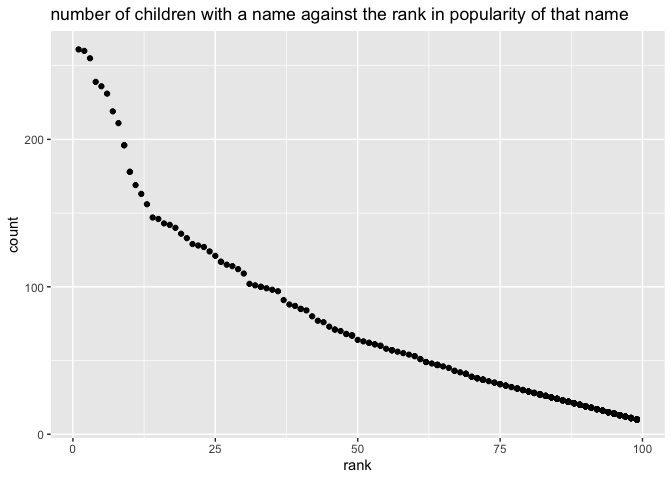

P8105 Homework 2 \[td2704\]
================

## Problem 1

Mr. Trash Wheel sheet.

``` r
# order below
## specify sheet, omit non-data entries
## clean variable names to standardize
## omit rows without dumpster-specific data (remove na's in dumpster column)
## round number of sports balls to nearest integer

trashwheel_df = 
  read_excel("data/Trash-Wheel-Collection-Totals-7-2020-2.xlsx",
                           sheet = "Mr. Trash Wheel",
                           range = "A2:N408") %>%
  janitor::clean_names() %>%
  drop_na(dumpster) %>%
  mutate(
    sports_balls = round(sports_balls, digits = 0)
  )

trashwheel_df
```

    ## # A tibble: 345 × 14
    ##    dumpster month  year date                weight_tons volume_cubic_yards
    ##       <dbl> <chr> <dbl> <dttm>                    <dbl>              <dbl>
    ##  1        1 May    2014 2014-05-16 00:00:00        4.31                 18
    ##  2        2 May    2014 2014-05-16 00:00:00        2.74                 13
    ##  3        3 May    2014 2014-05-16 00:00:00        3.45                 15
    ##  4        4 May    2014 2014-05-17 00:00:00        3.1                  15
    ##  5        5 May    2014 2014-05-17 00:00:00        4.06                 18
    ##  6        6 May    2014 2014-05-20 00:00:00        2.71                 13
    ##  7        7 May    2014 2014-05-21 00:00:00        1.91                  8
    ##  8        8 May    2014 2014-05-28 00:00:00        3.7                  16
    ##  9        9 June   2014 2014-06-05 00:00:00        2.52                 14
    ## 10       10 June   2014 2014-06-11 00:00:00        3.76                 18
    ## # … with 335 more rows, and 8 more variables: plastic_bottles <dbl>,
    ## #   polystyrene <dbl>, cigarette_butts <dbl>, glass_bottles <dbl>,
    ## #   grocery_bags <dbl>, chip_bags <dbl>, sports_balls <dbl>,
    ## #   homes_powered <dbl>

Precipitation data for 2018 annd 2019.

``` r
precip18_df = 
  read_excel("data/Trash-Wheel-Collection-Totals-7-2020-2.xlsx",
             sheet = "2018 Precipitation",
             range = "A2:B14") %>%
  janitor::clean_names() %>%
  mutate(
    year = rep(2018, times = 12)
  ) %>%
  relocate(year)

precip18_df
```

    ## # A tibble: 12 × 3
    ##     year month total
    ##    <dbl> <dbl> <dbl>
    ##  1  2018     1  0.94
    ##  2  2018     2  4.8 
    ##  3  2018     3  2.69
    ##  4  2018     4  4.69
    ##  5  2018     5  9.27
    ##  6  2018     6  4.77
    ##  7  2018     7 10.2 
    ##  8  2018     8  6.45
    ##  9  2018     9 10.5 
    ## 10  2018    10  2.12
    ## 11  2018    11  7.82
    ## 12  2018    12  6.11

``` r
precip19_df = 
  read_excel("data/Trash-Wheel-Collection-Totals-7-2020-2.xlsx",
             sheet = "2019 Precipitation",
             range = "A2:B14") %>%
  janitor::clean_names() %>%
  mutate(
    year = rep(2019, times = 12)
  ) %>%
  relocate(year)

precip19_df
```

    ## # A tibble: 12 × 3
    ##     year month total
    ##    <dbl> <dbl> <dbl>
    ##  1  2019     1  3.1 
    ##  2  2019     2  3.64
    ##  3  2019     3  4.47
    ##  4  2019     4  1.46
    ##  5  2019     5  3.58
    ##  6  2019     6  0.42
    ##  7  2019     7  3.85
    ##  8  2019     8  2.39
    ##  9  2019     9  0.16
    ## 10  2019    10  5.45
    ## 11  2019    11  1.86
    ## 12  2019    12  3.57

``` r
precip_combined_df = 
  bind_rows(precip18_df,precip19_df) %>%
  mutate(
    month = month.name[month]
  )

precip_combined_df
```

    ## # A tibble: 24 × 3
    ##     year month     total
    ##    <dbl> <chr>     <dbl>
    ##  1  2018 January    0.94
    ##  2  2018 February   4.8 
    ##  3  2018 March      2.69
    ##  4  2018 April      4.69
    ##  5  2018 May        9.27
    ##  6  2018 June       4.77
    ##  7  2018 July      10.2 
    ##  8  2018 August     6.45
    ##  9  2018 September 10.5 
    ## 10  2018 October    2.12
    ## # … with 14 more rows

The Mr. Trash Wheel dataset has 345 rows of 14 variables: dumpster,
month, year, date, weight\_tons, volume\_cubic\_yards, plastic\_bottles,
polystyrene, cigarette\_butts, glass\_bottles, grocery\_bags,
chip\_bags, sports\_balls, homes\_powered. It tracks homes powered by
various recycled/reused items over the years 2014, 2015, 2016, 2017,
2018, 2019. The median number of sports balls in a dumpster in 2019 was
9. The resulting precipitation dataset has 24 rows of 3 variables: year,
month, total. Years included in this dataset are 2018, 2019, and the
amount of precipitation is listed for each month, year pair. From this
data, the total precipitation in 2018 was 70.33.

## Problem 2

Assume any nonzero values count as TRUE for president column

``` r
pols_month_df2 = 
  read_csv("data/fivethirtyeight_datasets/pols-month.csv") %>%
  janitor::clean_names() %>%
  filter(
    prez_gop == 2
  )
```

    ## Rows: 822 Columns: 9

    ## ── Column specification ────────────────────────────────────────────────────────
    ## Delimiter: ","
    ## dbl  (8): prez_gop, gov_gop, sen_gop, rep_gop, prez_dem, gov_dem, sen_dem, r...
    ## date (1): mon

    ## 
    ## ℹ Use `spec()` to retrieve the full column specification for this data.
    ## ℹ Specify the column types or set `show_col_types = FALSE` to quiet this message.

``` r
pols_month_df2
```

    ## # A tibble: 5 × 9
    ##   mon        prez_gop gov_gop sen_gop rep_gop prez_dem gov_dem sen_dem rep_dem
    ##   <date>        <dbl>   <dbl>   <dbl>   <dbl>    <dbl>   <dbl>   <dbl>   <dbl>
    ## 1 1974-08-15        2      18      45     195        0      34      59     249
    ## 2 1974-09-15        2      18      45     195        0      34      59     249
    ## 3 1974-10-15        2      18      45     195        0      34      59     249
    ## 4 1974-11-15        2      18      45     195        0      34      59     249
    ## 5 1974-12-15        2      18      45     195        0      34      59     249

``` r
pols_month_df = 
  read_csv("data/fivethirtyeight_datasets/pols-month.csv") %>%
  janitor::clean_names() %>%
  separate(mon, into = c("year", "month", "day"), sep = "-", convert = TRUE) %>%
  mutate(
    month = month.name[month]
  ) %>%
  pivot_longer(
    cols = starts_with("prez_"),
    names_to="president",
    names_prefix = "prez_",
    values_to="president_boolean"
  ) %>%
  filter(president_boolean!=0) %>%
  select(-president_boolean, -day)
```

    ## Rows: 822 Columns: 9

    ## ── Column specification ────────────────────────────────────────────────────────
    ## Delimiter: ","
    ## dbl  (8): prez_gop, gov_gop, sen_gop, rep_gop, prez_dem, gov_dem, sen_dem, r...
    ## date (1): mon

    ## 
    ## ℹ Use `spec()` to retrieve the full column specification for this data.
    ## ℹ Specify the column types or set `show_col_types = FALSE` to quiet this message.

``` r
pols_month_df
```

    ## # A tibble: 822 × 9
    ##     year month     gov_gop sen_gop rep_gop gov_dem sen_dem rep_dem president
    ##    <int> <chr>       <dbl>   <dbl>   <dbl>   <dbl>   <dbl>   <dbl> <chr>    
    ##  1  1947 January        23      51     253      23      45     198 dem      
    ##  2  1947 February       23      51     253      23      45     198 dem      
    ##  3  1947 March          23      51     253      23      45     198 dem      
    ##  4  1947 April          23      51     253      23      45     198 dem      
    ##  5  1947 May            23      51     253      23      45     198 dem      
    ##  6  1947 June           23      51     253      23      45     198 dem      
    ##  7  1947 July           23      51     253      23      45     198 dem      
    ##  8  1947 August         23      51     253      23      45     198 dem      
    ##  9  1947 September      23      51     253      23      45     198 dem      
    ## 10  1947 October        23      51     253      23      45     198 dem      
    ## # … with 812 more rows

``` r
snp_df = 
  read_csv("data/fivethirtyeight_datasets/snp.csv") %>%
  janitor::clean_names() %>%
  separate(date, into = c("month", "day", "year"), sep = "/", convert = TRUE) %>%
  relocate(year,month) %>%
  mutate(
    year = ifelse(year >= 1950 %% 100, 1900+year, 2000+year), # to get proper 4 digit year
  ) %>%
  select(-day) %>%
  arrange(year,month) %>%
  mutate(
    month = month.name[month]
  )
```

    ## Rows: 787 Columns: 2

    ## ── Column specification ────────────────────────────────────────────────────────
    ## Delimiter: ","
    ## chr (1): date
    ## dbl (1): close

    ## 
    ## ℹ Use `spec()` to retrieve the full column specification for this data.
    ## ℹ Specify the column types or set `show_col_types = FALSE` to quiet this message.

``` r
snp_df
```

    ## # A tibble: 787 × 3
    ##     year month     close
    ##    <dbl> <chr>     <dbl>
    ##  1  1950 January    17.0
    ##  2  1950 February   17.2
    ##  3  1950 March      17.3
    ##  4  1950 April      18.0
    ##  5  1950 May        18.8
    ##  6  1950 June       17.7
    ##  7  1950 July       17.8
    ##  8  1950 August     18.4
    ##  9  1950 September  19.5
    ## 10  1950 October    19.5
    ## # … with 777 more rows

``` r
unemployment_df = 
  read_csv("data/fivethirtyeight_datasets/unemployment.csv") %>%
  janitor::clean_names() %>%
  pivot_longer(
    jan:dec,
    names_to="month",
    values_to="perc_unemployment"
  ) %>%
  mutate(
    year = as.integer(year),
    month = month.name[(match(month, tolower(month.abb)))]
  )
```

    ## Rows: 68 Columns: 13

    ## ── Column specification ────────────────────────────────────────────────────────
    ## Delimiter: ","
    ## dbl (13): Year, Jan, Feb, Mar, Apr, May, Jun, Jul, Aug, Sep, Oct, Nov, Dec

    ## 
    ## ℹ Use `spec()` to retrieve the full column specification for this data.
    ## ℹ Specify the column types or set `show_col_types = FALSE` to quiet this message.

``` r
unemployment_df
```

    ## # A tibble: 816 × 3
    ##     year month     perc_unemployment
    ##    <int> <chr>                 <dbl>
    ##  1  1948 January                 3.4
    ##  2  1948 February                3.8
    ##  3  1948 March                   4  
    ##  4  1948 April                   3.9
    ##  5  1948 May                     3.5
    ##  6  1948 June                    3.6
    ##  7  1948 July                    3.6
    ##  8  1948 August                  3.9
    ##  9  1948 September               3.8
    ## 10  1948 October                 3.7
    ## # … with 806 more rows

Merge snp into pols first. Then merge unemployment into result.

Inner join:

``` r
joined_df = 
  inner_join(pols_month_df, snp_df, by = c("year","month")) %>%
  inner_join(unemployment_df, by = c("year","month"))

joined_df
```

    ## # A tibble: 786 × 11
    ##     year month   gov_gop sen_gop rep_gop gov_dem sen_dem rep_dem president close
    ##    <dbl> <chr>     <dbl>   <dbl>   <dbl>   <dbl>   <dbl>   <dbl> <chr>     <dbl>
    ##  1  1950 January      18      44     177      29      57     269 dem        17.0
    ##  2  1950 Februa…      18      44     177      29      57     269 dem        17.2
    ##  3  1950 March        18      44     177      29      57     269 dem        17.3
    ##  4  1950 April        18      44     177      29      57     269 dem        18.0
    ##  5  1950 May          18      44     177      29      57     269 dem        18.8
    ##  6  1950 June         18      44     177      29      57     269 dem        17.7
    ##  7  1950 July         18      44     177      29      57     269 dem        17.8
    ##  8  1950 August       18      44     177      29      57     269 dem        18.4
    ##  9  1950 Septem…      18      44     177      29      57     269 dem        19.5
    ## 10  1950 October      18      44     177      29      57     269 dem        19.5
    ## # … with 776 more rows, and 1 more variable: perc_unemployment <dbl>

The first dataset pols\_month\_df contains the number of national
politicians who are Democratic or Republican at any given time,
including president, governors, senators, etc - it has 822 rows with
variables year, month, gov\_gop, sen\_gop, rep\_gop, gov\_dem, sen\_dem,
rep\_dem, president. This dataset comes from the years 1947 to 2015. The
second dataset snp\_df contains the S&P stock market index over year,
month pairs - it has 787 rows with variables year, month, close. This
dataset comes from the years 1950 to 2015. The final dataset
unemployment\_df contains the unemployment percentage in the US over
year, month pairs - it has 816 rows with variables year, month,
perc\_unemployment. This dataset comes from the years 1948 to 2015. The
resulting dataset joined\_df combines all this data into one dataframe
of size 786 rows and 11 columns with variables year, month, gov\_gop,
sen\_gop, rep\_gop, gov\_dem, sen\_dem, rep\_dem, president, close,
perc\_unemployment. It includes, by month,year pair, the number of
Democratic and Republican politicians across the US, as well as the S&P
stock index and unemployment rate at that time as well to provide
pointers for the economy at that time. This joined dataset spans the
years 1950 to 2015. This joined dataset has only year,month pairs data
that exists in all 3 of the individual datasets.

If we use left join instead:

Left join:

``` r
joined_df_left = 
  left_join(pols_month_df, snp_df, by = c("year","month")) %>%
  left_join(unemployment_df, by = c("year","month"))

joined_df_left
```

    ## # A tibble: 822 × 11
    ##     year month   gov_gop sen_gop rep_gop gov_dem sen_dem rep_dem president close
    ##    <dbl> <chr>     <dbl>   <dbl>   <dbl>   <dbl>   <dbl>   <dbl> <chr>     <dbl>
    ##  1  1947 January      23      51     253      23      45     198 dem          NA
    ##  2  1947 Februa…      23      51     253      23      45     198 dem          NA
    ##  3  1947 March        23      51     253      23      45     198 dem          NA
    ##  4  1947 April        23      51     253      23      45     198 dem          NA
    ##  5  1947 May          23      51     253      23      45     198 dem          NA
    ##  6  1947 June         23      51     253      23      45     198 dem          NA
    ##  7  1947 July         23      51     253      23      45     198 dem          NA
    ##  8  1947 August       23      51     253      23      45     198 dem          NA
    ##  9  1947 Septem…      23      51     253      23      45     198 dem          NA
    ## 10  1947 October      23      51     253      23      45     198 dem          NA
    ## # … with 812 more rows, and 1 more variable: perc_unemployment <dbl>

The first dataset pols\_month\_df contains the number of national
politicians who are Democratic or Republican at any given time,
including president, governors, senators, etc - it has 822 rows with
variables year, month, gov\_gop, sen\_gop, rep\_gop, gov\_dem, sen\_dem,
rep\_dem, president. This dataset comes from the years 1947 to 2015. The
second dataset snp\_df contains the S&P stock market index over year,
month pairs - it has 787 rows with variables year, month, close. This
dataset comes from the years 1950 to 2015. The final dataset
unemployment\_df contains the unemployment percentage in the US over
year, month pairs - it has 816 rows with variables year, month,
perc\_unemployment. This dataset comes from the years 1948 to 2015. The
resulting dataset left\_joined\_df combines all this data into one
dataframe of size 822 rows and 11 columns with variables year, month,
gov\_gop, sen\_gop, rep\_gop, gov\_dem, sen\_dem, rep\_dem, president,
close, perc\_unemployment. It includes, by month,year pair, the number
of Democratic and Republican politicians across the US, as well as the
S&P stock index and unemployment rate at that time as well to provide
pointers for the economy at that time. This joined dataset spans the
years 1947 to 2015. This left joined dataset has all year,month pairs
data that exist in pols\_month\_df, where some values for close and
unemployment may be N/A if those year,month pairs didn’t exist in the
other datasets. Hence, this is a larger dataset than the inner joined
dataframe but may be more incomplete.

## Problem 3

Tidy the data.

``` r
babynames_df = 
  read_csv("data/Popular_Baby_Names.csv") %>%
  janitor::clean_names()  %>%
  mutate(
    ethnicity = replace(ethnicity, ethnicity == "WHITE NON HISP", "WHITE NON HISPANIC"),
    ethnicity = replace(ethnicity, ethnicity == "ASIAN AND PACI", "ASIAN AND PACIFIC ISLANDER"),
    ethnicity = replace(ethnicity, ethnicity == "BLACK NON HISP", "BLACK NON HISPANIC"),
    childs_first_name = toupper(childs_first_name)
  ) %>%
  distinct(.keep_all=TRUE)
```

    ## Rows: 19418 Columns: 6

    ## ── Column specification ────────────────────────────────────────────────────────
    ## Delimiter: ","
    ## chr (3): Gender, Ethnicity, Child's First Name
    ## dbl (3): Year of Birth, Count, Rank

    ## 
    ## ℹ Use `spec()` to retrieve the full column specification for this data.
    ## ℹ Specify the column types or set `show_col_types = FALSE` to quiet this message.

``` r
babynames_df
```

    ## # A tibble: 12,181 × 6
    ##    year_of_birth gender ethnicity                  childs_first_name count  rank
    ##            <dbl> <chr>  <chr>                      <chr>             <dbl> <dbl>
    ##  1          2016 FEMALE ASIAN AND PACIFIC ISLANDER OLIVIA              172     1
    ##  2          2016 FEMALE ASIAN AND PACIFIC ISLANDER CHLOE               112     2
    ##  3          2016 FEMALE ASIAN AND PACIFIC ISLANDER SOPHIA              104     3
    ##  4          2016 FEMALE ASIAN AND PACIFIC ISLANDER EMILY                99     4
    ##  5          2016 FEMALE ASIAN AND PACIFIC ISLANDER EMMA                 99     4
    ##  6          2016 FEMALE ASIAN AND PACIFIC ISLANDER MIA                  79     5
    ##  7          2016 FEMALE ASIAN AND PACIFIC ISLANDER CHARLOTTE            59     6
    ##  8          2016 FEMALE ASIAN AND PACIFIC ISLANDER SARAH                57     7
    ##  9          2016 FEMALE ASIAN AND PACIFIC ISLANDER ISABELLA             56     8
    ## 10          2016 FEMALE ASIAN AND PACIFIC ISLANDER HANNAH               56     8
    ## # … with 12,171 more rows

rank in popularity of the name “Olivia” as a female baby name over time:

``` r
olivia_rank = 
  filter(babynames_df,childs_first_name=="OLIVIA") %>%
  filter(gender=="FEMALE") %>%
  arrange(year_of_birth) %>%
  select(-count) %>%
  pivot_wider(
    names_from = "year_of_birth",
    values_from = "rank"
  ) %>%
  relocate(childs_first_name) %>%
  knitr::kable()
  

olivia_rank
```

| childs\_first\_name | gender | ethnicity                  | 2011 | 2012 | 2013 | 2014 | 2015 | 2016 |
|:--------------------|:-------|:---------------------------|-----:|-----:|-----:|-----:|-----:|-----:|
| OLIVIA              | FEMALE | ASIAN AND PACIFIC ISLANDER |    4 |    3 |    3 |    1 |    1 |    1 |
| OLIVIA              | FEMALE | BLACK NON HISPANIC         |   10 |    8 |    6 |    8 |    4 |    8 |
| OLIVIA              | FEMALE | HISPANIC                   |   18 |   22 |   22 |   16 |   16 |   13 |
| OLIVIA              | FEMALE | WHITE NON HISPANIC         |    2 |    4 |    1 |    1 |    1 |    1 |

most popular name among male children over time

``` r
male_rank = 
  filter(babynames_df,gender=="MALE") %>%
  arrange(rank,year_of_birth) %>%
  select(-count) %>%
  pivot_wider(
    names_from = "year_of_birth",
    values_from = "rank"
  ) %>%
  relocate(childs_first_name) %>%
  knitr::kable()
  

male_rank
```

| childs\_first\_name | gender | ethnicity                  | 2011 | 2012 | 2013 | 2014 | 2015 | 2016 |
|:--------------------|:-------|:---------------------------|-----:|-----:|-----:|-----:|-----:|-----:|
| ETHAN               | MALE   | ASIAN AND PACIFIC ISLANDER |    1 |    2 |    2 |    2 |    2 |    1 |
| JAYDEN              | MALE   | BLACK NON HISPANIC         |    1 |    1 |    2 |    3 |   10 |   11 |
| JAYDEN              | MALE   | HISPANIC                   |    1 |    1 |    1 |    4 |    7 |    8 |
| MICHAEL             | MALE   | WHITE NON HISPANIC         |    1 |    3 |    3 |    3 |    6 |    2 |
| RYAN                | MALE   | ASIAN AND PACIFIC ISLANDER |    3 |    1 |    3 |    3 |    3 |    2 |
| JOSEPH              | MALE   | WHITE NON HISPANIC         |    2 |    1 |    2 |    1 |    2 |    1 |
| JAYDEN              | MALE   | ASIAN AND PACIFIC ISLANDER |    2 |    2 |    1 |    1 |    1 |    5 |
| ETHAN               | MALE   | BLACK NON HISPANIC         |    6 |    3 |    1 |    1 |    5 |    5 |
| DAVID               | MALE   | WHITE NON HISPANIC         |    4 |    2 |    1 |    2 |    1 |    3 |
| LIAM                | MALE   | HISPANIC                   |   32 |   24 |   11 |    1 |    1 |    1 |
| NOAH                | MALE   | BLACK NON HISPANIC         |   11 |    9 |    3 |    2 |    1 |    1 |
| AIDEN               | MALE   | BLACK NON HISPANIC         |    2 |    2 |    3 |    3 |    3 |    2 |
| JUSTIN              | MALE   | HISPANIC                   |    2 |    8 |   15 |   22 |   28 |   29 |
| JACOB               | MALE   | HISPANIC                   |    3 |    2 |    2 |    2 |    6 |    2 |
| DYLAN               | MALE   | HISPANIC                   |   23 |   15 |    3 |    2 |    2 |    3 |
| LIAM                | MALE   | BLACK NON HISPANIC         |   24 |   11 |   10 |    6 |    2 |    4 |
| ELIJAH              | MALE   | BLACK NON HISPANIC         |    3 |    6 |    4 |    4 |    6 |    3 |
| JACOB               | MALE   | WHITE NON HISPANIC         |    3 |    4 |    8 |    5 |    4 |    5 |
| LUCAS               | MALE   | ASIAN AND PACIFIC ISLANDER |    5 |    3 |    4 |    4 |    6 |    4 |
| MATTHEW             | MALE   | HISPANIC                   |    4 |    3 |    4 |    6 |    4 |    4 |
| NOAH                | MALE   | HISPANIC                   |   19 |   20 |    9 |    3 |    5 |    5 |
| ETHAN               | MALE   | HISPANIC                   |    6 |    4 |    5 |    5 |    3 |    7 |
| MOSHE               | MALE   | WHITE NON HISPANIC         |    6 |    5 |    4 |    4 |    3 |    4 |
| MUHAMMAD            | MALE   | ASIAN AND PACIFIC ISLANDER |   11 |    7 |    6 |    6 |    4 |    3 |
| JUSTIN              | MALE   | ASIAN AND PACIFIC ISLANDER |    4 |    4 |   11 |   17 |   22 |   15 |
| JEREMIAH            | MALE   | BLACK NON HISPANIC         |    4 |    4 |    6 |    5 |    4 |    6 |
| JOSHUA              | MALE   | BLACK NON HISPANIC         |    5 |    5 |    5 |    7 |    8 |    8 |
| ANGEL               | MALE   | HISPANIC                   |    5 |    5 |    8 |   10 |   10 |   12 |
| BENJAMIN            | MALE   | WHITE NON HISPANIC         |    5 |    8 |    6 |    6 |    5 |    7 |
| ERIC                | MALE   | ASIAN AND PACIFIC ISLANDER |    9 |    5 |    8 |    9 |   12 |   12 |
| AIDEN               | MALE   | ASIAN AND PACIFIC ISLANDER |    7 |    6 |    5 |    5 |    5 |    6 |
| DANIEL              | MALE   | WHITE NON HISPANIC         |    7 |    6 |    5 |    8 |    7 |    9 |
| JOSIAH              | MALE   | BLACK NON HISPANIC         |    7 |    8 |    9 |   11 |    5 |    9 |
| JASON               | MALE   | ASIAN AND PACIFIC ISLANDER |    6 |    8 |    9 |   10 |    8 |    9 |
| MICHAEL             | MALE   | BLACK NON HISPANIC         |   10 |    6 |   12 |   12 |   12 |   12 |
| AIDEN               | MALE   | HISPANIC                   |   12 |    6 |   14 |   15 |   12 |   10 |
| DANIEL              | MALE   | HISPANIC                   |    8 |    7 |    6 |    9 |    9 |   11 |
| SEBASTIAN           | MALE   | HISPANIC                   |   14 |   10 |   13 |    7 |    8 |    6 |
| JAMES               | MALE   | WHITE NON HISPANIC         |   12 |   10 |    7 |   11 |    9 |    6 |
| CHRISTOPHER         | MALE   | HISPANIC                   |    7 |   11 |   15 |   16 |   17 |   15 |
| CHRISTIAN           | MALE   | BLACK NON HISPANIC         |   11 |    7 |   13 |   14 |   16 |   16 |
| ALEXANDER           | MALE   | WHITE NON HISPANIC         |    8 |    7 |   10 |    7 |   10 |    8 |
| DANIEL              | MALE   | ASIAN AND PACIFIC ISLANDER |   10 |    9 |    7 |    7 |   16 |    7 |
| AMIR                | MALE   | BLACK NON HISPANIC         |   12 |   17 |    7 |   10 |   11 |    7 |
| ALEXANDER           | MALE   | HISPANIC                   |    9 |    9 |    7 |    8 |   13 |   13 |
| WILLIAM             | MALE   | ASIAN AND PACIFIC ISLANDER |   15 |   11 |   15 |    8 |    7 |   14 |
| MASON               | MALE   | BLACK NON HISPANIC         |   16 |    8 |    8 |    9 |    7 |    9 |
| KEVIN               | MALE   | ASIAN AND PACIFIC ISLANDER |    8 |   10 |   13 |   15 |   23 |   13 |
| ISAIAH              | MALE   | BLACK NON HISPANIC         |    8 |    9 |   16 |   22 |   15 |   18 |
| CARTER              | MALE   | BLACK NON HISPANIC         |   39 |   25 |   17 |    8 |    9 |   10 |
| EVAN                | MALE   | ASIAN AND PACIFIC ISLANDER |   19 |   13 |   14 |   11 |    8 |    8 |
| SAMUEL              | MALE   | WHITE NON HISPANIC         |   11 |    9 |   15 |    9 |    8 |   13 |
| TYLER               | MALE   | BLACK NON HISPANIC         |    9 |   10 |   11 |   13 |   17 |   17 |
| MATTHEW             | MALE   | WHITE NON HISPANIC         |    9 |   13 |   17 |   22 |   21 |   23 |
| JACK                | MALE   | WHITE NON HISPANIC         |   10 |   11 |    9 |   10 |   11 |   10 |
| LIAM                | MALE   | ASIAN AND PACIFIC ISLANDER |   41 |   29 |   10 |   16 |    9 |    9 |
| LUCAS               | MALE   | HISPANIC                   |   26 |   29 |   16 |   11 |   11 |    9 |
| HENRY               | MALE   | WHITE NON HISPANIC         |   16 |   16 |   13 |   14 |   13 |    9 |
| ANTHONY             | MALE   | HISPANIC                   |   10 |   12 |   13 |   17 |   15 |   20 |
| MASON               | MALE   | HISPANIC                   |   17 |   13 |   10 |   12 |   14 |   14 |
| MATTHEW             | MALE   | ASIAN AND PACIFIC ISLANDER |   12 |   12 |   12 |   12 |   10 |   10 |
| LOGAN               | MALE   | BLACK NON HISPANIC         |   49 |   33 |   25 |   16 |   10 |   14 |
| ADAM                | MALE   | WHITE NON HISPANIC         |   21 |   17 |   18 |   12 |   15 |   10 |
| JOSHUA              | MALE   | HISPANIC                   |   11 |   17 |   17 |   17 |   24 |   18 |
| WILLIAM             | MALE   | WHITE NON HISPANIC         |   13 |   16 |   11 |   13 |   12 |   11 |
| MOHAMMAD            | MALE   | ASIAN AND PACIFIC ISLANDER |   23 |   23 |   24 |   14 |   11 |   17 |
| AUSTIN              | MALE   | ASIAN AND PACIFIC ISLANDER |   16 |   18 |   19 |   14 |   15 |   11 |
| ABRAHAM             | MALE   | WHITE NON HISPANIC         |   12 |   20 |   20 |   15 |   17 |   12 |
| JUSTIN              | MALE   | BLACK NON HISPANIC         |   14 |   12 |   15 |   31 |   36 |   27 |
| CHAIM               | MALE   | WHITE NON HISPANIC         |   17 |   12 |   19 |   23 |   15 |   18 |
| DAVID               | MALE   | HISPANIC                   |   15 |   18 |   12 |   14 |   16 |   21 |
| JOHN                | MALE   | WHITE NON HISPANIC         |   14 |   15 |   12 |   17 |   18 |   15 |
| VINCENT             | MALE   | ASIAN AND PACIFIC ISLANDER |   13 |   15 |   23 |   25 |   24 |   23 |
| AYDEN               | MALE   | BLACK NON HISPANIC         |   13 |   14 |   27 |   21 |   22 |   23 |
| BRANDON             | MALE   | HISPANIC                   |   13 |   22 |   22 |   20 |   31 |   41 |
| RYAN                | MALE   | BLACK NON HISPANIC         |   33 |   13 |   23 |   28 |   33 |   26 |
| NICHOLAS            | MALE   | WHITE NON HISPANIC         |   15 |   13 |   16 |   16 |   18 |   19 |
| AARON               | MALE   | ASIAN AND PACIFIC ISLANDER |   19 |   19 |   13 |   14 |   17 |   18 |
| JACOB               | MALE   | ASIAN AND PACIFIC ISLANDER |   21 |   27 |   13 |   24 |   23 |   26 |
| MASON               | MALE   | ASIAN AND PACIFIC ISLANDER |   33 |   21 |   17 |   13 |   13 |   21 |
| MICHAEL             | MALE   | HISPANIC                   |   16 |   14 |   16 |   13 |   18 |   22 |
| CHASE               | MALE   | BLACK NON HISPANIC         |   33 |   21 |   23 |   16 |   13 |   14 |
| DAVID               | MALE   | BLACK NON HISPANIC         |   15 |   16 |   26 |   28 |   19 |   13 |
| ANDREW              | MALE   | ASIAN AND PACIFIC ISLANDER |   14 |   19 |   25 |   14 |   21 |   26 |
| KEVIN               | MALE   | HISPANIC                   |   14 |   16 |   18 |   24 |   34 |   30 |
| JONATHAN            | MALE   | HISPANIC                   |   14 |   21 |   23 |   26 |   25 |   33 |
| DYLAN               | MALE   | ASIAN AND PACIFIC ISLANDER |   17 |   14 |   24 |   22 |   20 |   25 |
| RYAN                | MALE   | WHITE NON HISPANIC         |   24 |   14 |   22 |   20 |   25 |   21 |
| JACOB               | MALE   | BLACK NON HISPANIC         |   17 |   20 |   14 |   15 |   14 |   18 |
| NOAH                | MALE   | WHITE NON HISPANIC         |   31 |   21 |   14 |   21 |   20 |   14 |
| ALEXANDER           | MALE   | ASIAN AND PACIFIC ISLANDER |   22 |   16 |   16 |   21 |   14 |   22 |
| OLIVER              | MALE   | WHITE NON HISPANIC         |   30 |   26 |   26 |   30 |   14 |   17 |
| IVAN                | MALE   | ASIAN AND PACIFIC ISLANDER |   15 |   17 |   24 |   28 |   27 |   28 |
| CHRISTOPHER         | MALE   | BLACK NON HISPANIC         |   19 |   15 |   22 |   23 |   39 |   25 |
| KING                | MALE   | BLACK NON HISPANIC         |   60 |   29 |   19 |   18 |   18 |   15 |
| DANIEL              | MALE   | BLACK NON HISPANIC         |   18 |   16 |   18 |   23 |   35 |   21 |
| THEODORE            | MALE   | WHITE NON HISPANIC         |   58 |   35 |   35 |   24 |   16 |   26 |
| OWEN                | MALE   | ASIAN AND PACIFIC ISLANDER |   39 |   24 |   18 |   24 |   24 |   16 |
| AARON               | MALE   | HISPANIC                   |   33 |   28 |   25 |   21 |   22 |   16 |
| ISAAC               | MALE   | WHITE NON HISPANIC         |   36 |   25 |   25 |   25 |   29 |   16 |
| KAYDEN              | MALE   | BLACK NON HISPANIC         |   37 |   25 |   25 |   17 |   22 |   22 |
| NOAH                | MALE   | ASIAN AND PACIFIC ISLANDER |   47 |   25 |   20 |   29 |   17 |   18 |
| OLIVER              | MALE   | ASIAN AND PACIFIC ISLANDER |   56 |   44 |   36 |   18 |   18 |   17 |
| CAMERON             | MALE   | BLACK NON HISPANIC         |   29 |   23 |   27 |   34 |   23 |   17 |
| MATEO               | MALE   | HISPANIC                   |   62 |   44 |   54 |   49 |   27 |   17 |
| ALEX                | MALE   | ASIAN AND PACIFIC ISLANDER |   18 |   24 |   24 |   26 |   26 |   33 |
| GABRIEL             | MALE   | HISPANIC                   |   18 |   26 |   21 |   19 |   23 |   23 |
| ANTHONY             | MALE   | WHITE NON HISPANIC         |   18 |   19 |   24 |   29 |   33 |   33 |
| JORDAN              | MALE   | BLACK NON HISPANIC         |   28 |   18 |   29 |   33 |   34 |   36 |
| MATTHEW             | MALE   | BLACK NON HISPANIC         |   25 |   18 |   21 |   25 |   21 |   33 |
| CHARLES             | MALE   | WHITE NON HISPANIC         |   21 |   18 |   22 |   22 |   23 |   30 |
| KAIDEN              | MALE   | BLACK NON HISPANIC         |   46 |   39 |   18 |   19 |   26 |   23 |
| AYAAN               | MALE   | ASIAN AND PACIFIC ISLANDER |   35 |   32 |   24 |   18 |   31 |   37 |
| ADRIAN              | MALE   | HISPANIC                   |   19 |   19 |   20 |   18 |   19 |   19 |
| ETHAN               | MALE   | WHITE NON HISPANIC         |   26 |   21 |   23 |   18 |   19 |   20 |
| JAMES               | MALE   | ASIAN AND PACIFIC ISLANDER |   31 |   30 |   22 |   20 |   18 |   29 |
| ANDREW              | MALE   | WHITE NON HISPANIC         |   19 |   24 |   27 |   38 |   34 |   31 |
| AARON               | MALE   | BLACK NON HISPANIC         |   28 |   19 |   37 |   38 |   20 |   29 |
| JOSEPH              | MALE   | HISPANIC                   |   22 |   23 |   19 |   25 |   20 |   26 |
| KYLE                | MALE   | ASIAN AND PACIFIC ISLANDER |   24 |   20 |   31 |   19 |   25 |   27 |
| LIAM                | MALE   | WHITE NON HISPANIC         |   20 |   20 |   21 |   19 |   20 |   22 |
| NATHAN              | MALE   | ASIAN AND PACIFIC ISLANDER |   26 |   36 |   22 |   23 |   19 |   21 |
| HENRY               | MALE   | ASIAN AND PACIFIC ISLANDER |   45 |   39 |   34 |   38 |   23 |   19 |
| MALACHI             | MALE   | BLACK NON HISPANIC         |   21 |   22 |   34 |   28 |   32 |   19 |
| JONATHAN            | MALE   | ASIAN AND PACIFIC ISLANDER |   20 |   26 |   28 |   28 |   27 |   27 |
| JADEN               | MALE   | BLACK NON HISPANIC         |   20 |   25 |   31 |   44 |   44 |   33 |
| CHRISTIAN           | MALE   | HISPANIC                   |   20 |   25 |   28 |   37 |   31 |   39 |
| DYLAN               | MALE   | BLACK NON HISPANIC         |   32 |   20 |   29 |   24 |   34 |   35 |
| ANTHONY             | MALE   | BLACK NON HISPANIC         |   22 |   20 |   28 |   35 |   31 |   34 |
| CALEB               | MALE   | BLACK NON HISPANIC         |   31 |   33 |   20 |   23 |   29 |   28 |
| NATHAN              | MALE   | BLACK NON HISPANIC         |   42 |   27 |   24 |   20 |   25 |   28 |
| BENJAMIN            | MALE   | ASIAN AND PACIFIC ISLANDER |   28 |   28 |   37 |   24 |   22 |   20 |
| ZION                | MALE   | BLACK NON HISPANIC         |   39 |   31 |   24 |   33 |   32 |   20 |
| JOSE                | MALE   | HISPANIC                   |   21 |   25 |   24 |   33 |   29 |   30 |
| NATHANIEL           | MALE   | BLACK NON HISPANIC         |   23 |   21 |   30 |   27 |   27 |   32 |
| BRIAN               | MALE   | ASIAN AND PACIFIC ISLANDER |   27 |   32 |   21 |   34 |   39 |   32 |
| MESSIAH             | MALE   | BLACK NON HISPANIC         |   51 |   41 |   32 |   26 |   21 |   23 |
| LOGAN               | MALE   | HISPANIC                   |   61 |   51 |   38 |   29 |   21 |   23 |
| LUCAS               | MALE   | WHITE NON HISPANIC         |   22 |   23 |   23 |   26 |   22 |   27 |
| JEREMY              | MALE   | ASIAN AND PACIFIC ISLANDER |   49 |   22 |   45 |   39 |   36 |   37 |
| JASON               | MALE   | BLACK NON HISPANIC         |   31 |   22 |   38 |   38 |   52 |   35 |
| THOMAS              | MALE   | WHITE NON HISPANIC         |   25 |   22 |   31 |   27 |   30 |   29 |
| DYLAN               | MALE   | WHITE NON HISPANIC         |   23 |   23 |   22 |   36 |   35 |   32 |
| ANTHONY             | MALE   | ASIAN AND PACIFIC ISLANDER |   23 |   29 |   32 |   37 |   39 |   44 |
| ANDY                | MALE   | ASIAN AND PACIFIC ISLANDER |   25 |   23 |   32 |   29 |   28 |   38 |
| TRISTAN             | MALE   | BLACK NON HISPANIC         |   26 |   23 |   23 |   25 |   36 |   30 |
| LEO                 | MALE   | ASIAN AND PACIFIC ISLANDER |   27 |   30 |   23 |   24 |   25 |   23 |
| ELIJAH              | MALE   | HISPANIC                   |   29 |   35 |   29 |   23 |   39 |   31 |
| ISAAC               | MALE   | HISPANIC                   |   42 |   37 |   35 |   38 |   23 |   24 |
| LUIS                | MALE   | HISPANIC                   |   24 |   27 |   27 |   35 |   36 |   32 |
| JOSEPH              | MALE   | BLACK NON HISPANIC         |   39 |   24 |   35 |   45 |   37 |   42 |
| XAVIER              | MALE   | BLACK NON HISPANIC         |   26 |   33 |   24 |   29 |   31 |   29 |
| JEREMY              | MALE   | HISPANIC                   |   28 |   31 |   24 |   28 |   27 |   37 |
| GABRIEL             | MALE   | BLACK NON HISPANIC         |   38 |   35 |   32 |   31 |   24 |   37 |
| GABRIEL             | MALE   | WHITE NON HISPANIC         |   33 |   27 |   28 |   32 |   24 |   24 |
| IAN                 | MALE   | ASIAN AND PACIFIC ISLANDER |   44 |   30 |   38 |   28 |   37 |   24 |
| SAMUEL              | MALE   | BLACK NON HISPANIC         |   44 |   36 |   28 |   46 |   36 |   24 |
| MOHAMED             | MALE   | BLACK NON HISPANIC         |   37 |   28 |   36 |   31 |   28 |   24 |
| ALVIN               | MALE   | ASIAN AND PACIFIC ISLANDER |   25 |   29 |   30 |   36 |   38 |   34 |
| ANDREW              | MALE   | HISPANIC                   |   25 |   32 |   40 |   39 |   32 |   40 |
| JONATHAN            | MALE   | BLACK NON HISPANIC         |   28 |   25 |   36 |   28 |   43 |   33 |
| BRANDON             | MALE   | BLACK NON HISPANIC         |   27 |   25 |   33 |   41 |   44 |   37 |
| ANDREW              | MALE   | BLACK NON HISPANIC         |   38 |   25 |   49 |   32 |   43 |   47 |
| YOSEF               | MALE   | WHITE NON HISPANIC         |   28 |   25 |   29 |   28 |   31 |   28 |
| KYRIE               | MALE   | BLACK NON HISPANIC         |   NA |   NA |   51 |   47 |   38 |   25 |
| IAN                 | MALE   | HISPANIC                   |   43 |   42 |   34 |   27 |   30 |   25 |
| LEO                 | MALE   | WHITE NON HISPANIC         |   39 |   28 |   30 |   31 |   26 |   25 |
| MOHAMMED            | MALE   | ASIAN AND PACIFIC ISLANDER |   26 |   37 |   49 |   33 |   32 |   40 |
| RYAN                | MALE   | HISPANIC                   |   26 |   28 |   26 |   32 |   33 |   27 |
| PRINCE              | MALE   | BLACK NON HISPANIC         |   42 |   26 |   32 |   49 |   33 |   33 |
| JOSHUA              | MALE   | ASIAN AND PACIFIC ISLANDER |   31 |   29 |   26 |   32 |   38 |   39 |
| BRANDON             | MALE   | ASIAN AND PACIFIC ISLANDER |   37 |   35 |   33 |   26 |   29 |   33 |
| ALEXANDER           | MALE   | BLACK NON HISPANIC         |   35 |   32 |   39 |   26 |   28 |   34 |
| ADAM                | MALE   | ASIAN AND PACIFIC ISLANDER |   38 |   32 |   32 |   33 |   26 |   41 |
| JAMES               | MALE   | HISPANIC                   |   45 |   47 |   39 |   34 |   26 |   34 |
| ELI                 | MALE   | WHITE NON HISPANIC         |   32 |   31 |   40 |   33 |   32 |   26 |
| AMARI               | MALE   | BLACK NON HISPANIC         |   27 |   30 |   40 |   42 |   30 |   31 |
| JEREMIAH            | MALE   | HISPANIC                   |   27 |   30 |   32 |   35 |   31 |   35 |
| MENACHEM            | MALE   | WHITE NON HISPANIC         |   27 |   40 |   49 |   27 |   36 |   39 |
| MAX                 | MALE   | WHITE NON HISPANIC         |   34 |   27 |   31 |   31 |   31 |   34 |
| DAVID               | MALE   | ASIAN AND PACIFIC ISLANDER |   38 |   33 |   27 |   38 |   31 |   43 |
| MICHAEL             | MALE   | ASIAN AND PACIFIC ISLANDER |   29 |   36 |   34 |   27 |   30 |   30 |
| NICHOLAS            | MALE   | ASIAN AND PACIFIC ISLANDER |   40 |   38 |   38 |   38 |   27 |   42 |
| JACE                | MALE   | BLACK NON HISPANIC         |   53 |   51 |   38 |   30 |   27 |   31 |
| SHIMON              | MALE   | WHITE NON HISPANIC         |   35 |   33 |   34 |   34 |   27 |   33 |
| JAYCE               | MALE   | BLACK NON HISPANIC         |   NA |   NA |   59 |   39 |   46 |   27 |
| JULIAN              | MALE   | HISPANIC                   |   35 |   33 |   30 |   30 |   35 |   27 |
| ZACHARY             | MALE   | WHITE NON HISPANIC         |   38 |   28 |   43 |   39 |   40 |   42 |
| LUCA                | MALE   | WHITE NON HISPANIC         |   46 |   44 |   45 |   36 |   28 |   40 |
| JOSIAH              | MALE   | HISPANIC                   |   58 |   58 |   49 |   58 |   44 |   28 |
| LUKE                | MALE   | WHITE NON HISPANIC         |   29 |   29 |   32 |   35 |   36 |   36 |
| JADEN               | MALE   | ASIAN AND PACIFIC ISLANDER |   43 |   31 |   29 |   38 |   30 |   42 |
| TENZIN              | MALE   | ASIAN AND PACIFIC ISLANDER |   42 |   41 |   42 |   29 |   39 |   36 |
| ALAN                | MALE   | ASIAN AND PACIFIC ISLANDER |   30 |   38 |   43 |   40 |   38 |   44 |
| EMMANUEL            | MALE   | BLACK NON HISPANIC         |   30 |   38 |   33 |   35 |   38 |   39 |
| CARLOS              | MALE   | HISPANIC                   |   30 |   34 |   37 |   40 |   43 |   38 |
| KYLE                | MALE   | BLACK NON HISPANIC         |   34 |   30 |   52 |   39 |   40 |   39 |
| MASON               | MALE   | WHITE NON HISPANIC         |   44 |   30 |   39 |   36 |   48 |   45 |
| CARSON              | MALE   | ASIAN AND PACIFIC ISLANDER |   46 |   61 |   57 |   30 |   46 |   54 |
| EASON               | MALE   | ASIAN AND PACIFIC ISLANDER |   56 |   41 |   35 |   30 |   34 |   35 |
| RAYMOND             | MALE   | ASIAN AND PACIFIC ISLANDER |   39 |   40 |   49 |   31 |   30 |   44 |
| KINGSLEY            | MALE   | ASIAN AND PACIFIC ISLANDER |   31 |   43 |   44 |   47 |   49 |   51 |
| STEVEN              | MALE   | HISPANIC                   |   31 |   48 |   41 |   45 |   53 |   51 |
| AYDEN               | MALE   | HISPANIC                   |   31 |   50 |   43 |   36 |   42 |   41 |
| TYLER               | MALE   | ASIAN AND PACIFIC ISLANDER |   35 |   33 |   31 |   35 |   37 |   46 |
| OSCAR               | MALE   | ASIAN AND PACIFIC ISLANDER |   41 |   54 |   31 |   41 |   38 |   45 |
| NICHOLAS            | MALE   | HISPANIC                   |   32 |   41 |   31 |   31 |   46 |   38 |
| SAMUEL              | MALE   | ASIAN AND PACIFIC ISLANDER |   36 |   37 |   34 |   46 |   38 |   31 |
| STEVEN              | MALE   | ASIAN AND PACIFIC ISLANDER |   32 |   43 |   34 |   50 |   45 |   48 |
| AARON               | MALE   | WHITE NON HISPANIC         |   49 |   32 |   42 |   39 |   45 |   58 |
| JAMES               | MALE   | BLACK NON HISPANIC         |   41 |   37 |   41 |   32 |   45 |   44 |
| SYED                | MALE   | ASIAN AND PACIFIC ISLANDER |   50 |   43 |   44 |   48 |   37 |   32 |
| JOEL                | MALE   | HISPANIC                   |   39 |   51 |   33 |   44 |   45 |   51 |
| JACKSON             | MALE   | WHITE NON HISPANIC         |   42 |   35 |   33 |   42 |   43 |   43 |
| IBRAHIM             | MALE   | ASIAN AND PACIFIC ISLANDER |   49 |   42 |   42 |   44 |   33 |   33 |
| KARTER              | MALE   | BLACK NON HISPANIC         |   NA |   NA |   55 |   37 |   33 |   39 |
| ASHTON              | MALE   | BLACK NON HISPANIC         |   56 |   55 |   49 |   42 |   51 |   33 |
| JOEL                | MALE   | BLACK NON HISPANIC         |   37 |   45 |   52 |   43 |   53 |   33 |
| DEREK               | MALE   | ASIAN AND PACIFIC ISLANDER |   34 |   38 |   43 |   36 |   40 |   45 |
| AIDAN               | MALE   | ASIAN AND PACIFIC ISLANDER |   34 |   34 |   42 |   39 |   48 |   44 |
| MIGUEL              | MALE   | HISPANIC                   |   34 |   38 |   36 |   50 |   52 |   64 |
| NICHOLAS            | MALE   | BLACK NON HISPANIC         |   43 |   34 |   43 |   41 |   41 |   43 |
| MORDECHAI           | MALE   | WHITE NON HISPANIC         |   43 |   34 |   43 |   37 |   43 |   37 |
| SEBASTIAN           | MALE   | WHITE NON HISPANIC         |   46 |   42 |   38 |   34 |   34 |   41 |
| ABDULLAH            | MALE   | ASIAN AND PACIFIC ISLANDER |   36 |   43 |   49 |   38 |   38 |   34 |
| HUNTER              | MALE   | BLACK NON HISPANIC         |   62 |   50 |   52 |   39 |   37 |   34 |
| NATHAN              | MALE   | HISPANIC                   |   60 |   45 |   46 |   42 |   49 |   34 |
| BENJAMIN            | MALE   | HISPANIC                   |   57 |   54 |   52 |   47 |   38 |   34 |
| SAMUEL              | MALE   | HISPANIC                   |   41 |   42 |   48 |   43 |   41 |   34 |
| JUAN                | MALE   | HISPANIC                   |   35 |   36 |   47 |   49 |   57 |   58 |
| BRYAN               | MALE   | HISPANIC                   |   35 |   38 |   40 |   41 |   56 |   60 |
| FELIX               | MALE   | ASIAN AND PACIFIC ISLANDER |   44 |   49 |   44 |   35 |   51 |   53 |
| ISAAC               | MALE   | ASIAN AND PACIFIC ISLANDER |   53 |   46 |   42 |   35 |   44 |   48 |
| JASPER              | MALE   | ASIAN AND PACIFIC ISLANDER |   NA |   57 |   52 |   50 |   35 |   35 |
| MAX                 | MALE   | ASIAN AND PACIFIC ISLANDER |   52 |   39 |   40 |   46 |   39 |   35 |
| YISROEL             | MALE   | WHITE NON HISPANIC         |   44 |   36 |   52 |   43 |   37 |   35 |
| JAYLEN              | MALE   | BLACK NON HISPANIC         |   36 |   42 |   47 |   51 |   56 |   53 |
| WILLIAM             | MALE   | HISPANIC                   |   36 |   47 |   48 |   54 |   48 |   55 |
| CHRISTOPHER         | MALE   | WHITE NON HISPANIC         |   36 |   42 |   37 |   46 |   43 |   46 |
| MARCUS              | MALE   | ASIAN AND PACIFIC ISLANDER |   46 |   36 |   43 |   40 |   47 |   42 |
| CALEB               | MALE   | ASIAN AND PACIFIC ISLANDER |   50 |   56 |   36 |   45 |   46 |   47 |
| JOSHUA              | MALE   | WHITE NON HISPANIC         |   37 |   38 |   36 |   49 |   40 |   52 |
| JAYCEON             | MALE   | BLACK NON HISPANIC         |   NA |   NA |   54 |   36 |   50 |   36 |
| ZACHARY             | MALE   | BLACK NON HISPANIC         |   52 |   45 |   49 |   36 |   53 |   39 |
| KAI                 | MALE   | ASIAN AND PACIFIC ISLANDER |   54 |   57 |   48 |   47 |   42 |   36 |
| JOHN                | MALE   | HISPANIC                   |   37 |   46 |   51 |   49 |   48 |   36 |
| RICHARD             | MALE   | ASIAN AND PACIFIC ISLANDER |   40 |   37 |   45 |   50 |   40 |   55 |
| ELI                 | MALE   | BLACK NON HISPANIC         |   52 |   37 |   46 |   50 |   51 |   46 |
| YEHUDA              | MALE   | WHITE NON HISPANIC         |   45 |   37 |   46 |   41 |   39 |   38 |
| WILLIAM             | MALE   | BLACK NON HISPANIC         |   47 |   49 |   37 |   49 |   54 |   49 |
| IKER                | MALE   | HISPANIC                   |   91 |   81 |   69 |   60 |   37 |   65 |
| ROBERT              | MALE   | WHITE NON HISPANIC         |   48 |   39 |   38 |   50 |   37 |   48 |
| LOGAN               | MALE   | ASIAN AND PACIFIC ISLANDER |   47 |   46 |   39 |   44 |   42 |   37 |
| ADONIS              | MALE   | BLACK NON HISPANIC         |   63 |   56 |   61 |   59 |   61 |   37 |
| BRYSON              | MALE   | BLACK NON HISPANIC         |   60 |   61 |   59 |   53 |   60 |   37 |
| XAVIER              | MALE   | HISPANIC                   |   38 |   40 |   42 |   41 |   50 |   42 |
| JASON               | MALE   | HISPANIC                   |   38 |   39 |   45 |   46 |   59 |   52 |
| ALLEN               | MALE   | ASIAN AND PACIFIC ISLANDER |   52 |   38 |   43 |   42 |   45 |   49 |
| ZACHARY             | MALE   | ASIAN AND PACIFIC ISLANDER |   54 |   38 |   46 |   43 |   40 |   44 |
| MAMADOU             | MALE   | BLACK NON HISPANIC         |   47 |   38 |   42 |   47 |   50 |   40 |
| CHRISTOPHER         | MALE   | ASIAN AND PACIFIC ISLANDER |   45 |   56 |   38 |   50 |   41 |   47 |
| KEVIN               | MALE   | BLACK NON HISPANIC         |   46 |   40 |   38 |   45 |   48 |   51 |
| ELIAS               | MALE   | HISPANIC                   |   48 |   46 |   44 |   38 |   49 |   42 |
| MICAH               | MALE   | BLACK NON HISPANIC         |   45 |   42 |   40 |   40 |   38 |   40 |
| LOGAN               | MALE   | WHITE NON HISPANIC         |   49 |   47 |   50 |   49 |   38 |   56 |
| DARREN              | MALE   | ASIAN AND PACIFIC ISLANDER |   45 |   45 |   40 |   53 |   41 |   38 |
| GAVIN               | MALE   | ASIAN AND PACIFIC ISLANDER |   39 |   46 |   43 |   48 |   45 |   38 |
| NASIR               | MALE   | BLACK NON HISPANIC         |   41 |   39 |   45 |   39 |   42 |   38 |
| ARJUN               | MALE   | ASIAN AND PACIFIC ISLANDER |   39 |   50 |   47 |   48 |   53 |   49 |
| JAIDEN              | MALE   | BLACK NON HISPANIC         |   39 |   42 |   53 |   49 |   58 |   49 |
| BRYCE               | MALE   | BLACK NON HISPANIC         |   39 |   39 |   39 |   40 |   48 |   39 |
| IBRAHIM             | MALE   | BLACK NON HISPANIC         |   49 |   43 |   39 |   48 |   55 |   41 |
| JONATHAN            | MALE   | WHITE NON HISPANIC         |   46 |   43 |   39 |   47 |   51 |   47 |
| NATHANIEL           | MALE   | ASIAN AND PACIFIC ISLANDER |   50 |   47 |   46 |   45 |   39 |   47 |
| RAYAN               | MALE   | ASIAN AND PACIFIC ISLANDER |   56 |   51 |   57 |   48 |   39 |   42 |
| NATHAN              | MALE   | WHITE NON HISPANIC         |   46 |   40 |   41 |   44 |   39 |   49 |
| JOHN                | MALE   | BLACK NON HISPANIC         |   40 |   54 |   56 |   50 |   53 |   50 |
| EVAN                | MALE   | HISPANIC                   |   40 |   57 |   52 |   60 |   49 |   63 |
| JULIAN              | MALE   | WHITE NON HISPANIC         |   40 |   45 |   50 |   40 |   47 |   40 |
| JERRY               | MALE   | ASIAN AND PACIFIC ISLANDER |   41 |   40 |   49 |   53 |   47 |   51 |
| OWEN                | MALE   | WHITE NON HISPANIC         |   51 |   46 |   48 |   40 |   49 |   46 |
| ANSON               | MALE   | ASIAN AND PACIFIC ISLANDER |   48 |   46 |   45 |   45 |   40 |   51 |
| JEFFREY             | MALE   | ASIAN AND PACIFIC ISLANDER |   41 |   42 |   55 |   51 |   40 |   54 |
| EMMANUEL            | MALE   | HISPANIC                   |   53 |   42 |   56 |   50 |   40 |   50 |
| YITZCHOK            | MALE   | WHITE NON HISPANIC         |   56 |   47 |   47 |   51 |   40 |   49 |
| JOSEPH              | MALE   | ASIAN AND PACIFIC ISLANDER |   45 |   42 |   44 |   50 |   43 |   40 |
| LUCAS               | MALE   | BLACK NON HISPANIC         |   62 |   56 |   49 |   50 |   52 |   40 |
| AUSTIN              | MALE   | BLACK NON HISPANIC         |   61 |   44 |   44 |   48 |   47 |   40 |
| AVERY               | MALE   | BLACK NON HISPANIC         |   55 |   51 |   53 |   47 |   52 |   40 |
| KAI                 | MALE   | BLACK NON HISPANIC         |   60 |   57 |   52 |   42 |   51 |   40 |
| OMARI               | MALE   | BLACK NON HISPANIC         |   55 |   54 |   NA |   57 |   49 |   40 |
| MEKHI               | MALE   | BLACK NON HISPANIC         |   41 |   50 |   55 |   47 |   59 |   52 |
| AIDEN               | MALE   | WHITE NON HISPANIC         |   41 |   43 |   51 |   45 |   42 |   49 |
| GEORGE              | MALE   | WHITE NON HISPANIC         |   50 |   41 |   59 |   52 |   41 |   44 |
| LUKE                | MALE   | ASIAN AND PACIFIC ISLANDER |   55 |   46 |   41 |   42 |   42 |   46 |
| BRYAN               | MALE   | ASIAN AND PACIFIC ISLANDER |   51 |   53 |   43 |   53 |   41 |   52 |
| CONNOR              | MALE   | ASIAN AND PACIFIC ISLANDER |   55 |   54 |   44 |   47 |   41 |   45 |
| ASHER               | MALE   | WHITE NON HISPANIC         |   57 |   50 |   61 |   48 |   41 |   48 |
| THEODORE            | MALE   | ASIAN AND PACIFIC ISLANDER |   NA |   59 |   50 |   46 |   45 |   41 |
| JULIAN              | MALE   | ASIAN AND PACIFIC ISLANDER |   55 |   50 |   48 |   51 |   43 |   41 |
| CHANCE              | MALE   | BLACK NON HISPANIC         |   59 |   46 |   49 |   44 |   53 |   41 |
| SEBASTIAN           | MALE   | BLACK NON HISPANIC         |   63 |   53 |   51 |   49 |   45 |   41 |
| AYDEN               | MALE   | ASIAN AND PACIFIC ISLANDER |   42 |   52 |   51 |   53 |   43 |   46 |
| JADEN               | MALE   | HISPANIC                   |   42 |   81 |   52 |   65 |   67 |   75 |
| JAKE                | MALE   | WHITE NON HISPANIC         |   42 |   51 |   59 |   67 |   57 |   70 |
| MARCUS              | MALE   | BLACK NON HISPANIC         |   50 |   42 |   54 |   52 |   53 |   56 |
| AYAN                | MALE   | ASIAN AND PACIFIC ISLANDER |   NA |   59 |   42 |   52 |   48 |   51 |
| JOHN                | MALE   | ASIAN AND PACIFIC ISLANDER |   45 |   45 |   42 |   42 |   48 |   52 |
| BENJAMIN            | MALE   | BLACK NON HISPANIC         |   61 |   47 |   42 |   42 |   52 |   48 |
| AIDAN               | MALE   | BLACK NON HISPANIC         |   54 |   57 |   42 |   NA |   NA |   53 |
| LAWRENCE            | MALE   | ASIAN AND PACIFIC ISLANDER |   52 |   58 |   48 |   42 |   50 |   53 |
| ADRIAN              | MALE   | ASIAN AND PACIFIC ISLANDER |   47 |   44 |   44 |   42 |   43 |   49 |
| ARHAM               | MALE   | ASIAN AND PACIFIC ISLANDER |   NA |   NA |   NA |   56 |   44 |   42 |
| JORDAN              | MALE   | ASIAN AND PACIFIC ISLANDER |   43 |   55 |   48 |   51 |   NA |   51 |
| WILSON              | MALE   | ASIAN AND PACIFIC ISLANDER |   43 |   56 |   49 |   57 |   49 |   59 |
| STANLEY             | MALE   | ASIAN AND PACIFIC ISLANDER |   43 |   53 |   51 |   54 |   54 |   57 |
| JORDAN              | MALE   | HISPANIC                   |   43 |   58 |   52 |   52 |   63 |   63 |
| CHRISTIAN           | MALE   | WHITE NON HISPANIC         |   43 |   43 |   62 |   53 |   61 |   68 |
| ISAIAH              | MALE   | HISPANIC                   |   45 |   43 |   50 |   61 |   51 |   59 |
| JESUS               | MALE   | HISPANIC                   |   45 |   43 |   49 |   48 |   54 |   46 |
| CHARLES             | MALE   | ASIAN AND PACIFIC ISLANDER |   49 |   49 |   43 |   47 |   43 |   52 |
| ARYAN               | MALE   | ASIAN AND PACIFIC ISLANDER |   48 |   57 |   43 |   50 |   50 |   47 |
| CAYDEN              | MALE   | BLACK NON HISPANIC         |   63 |   52 |   49 |   43 |   58 |   57 |
| KIMI                | MALE   | ASIAN AND PACIFIC ISLANDER |   NA |   NA |   55 |   44 |   43 |   59 |
| AHMED               | MALE   | ASIAN AND PACIFIC ISLANDER |   45 |   56 |   49 |   56 |   43 |   55 |
| HUNTER              | MALE   | ASIAN AND PACIFIC ISLANDER |   NA |   54 |   51 |   50 |   43 |   55 |
| LEONARDO            | MALE   | HISPANIC                   |   54 |   59 |   58 |   53 |   55 |   43 |
| EDWIN               | MALE   | HISPANIC                   |   44 |   60 |   69 |   67 |   77 |   70 |
| GABRIEL             | MALE   | ASIAN AND PACIFIC ISLANDER |   53 |   44 |   50 |   51 |   49 |   51 |
| KADEN               | MALE   | BLACK NON HISPANIC         |   52 |   55 |   44 |   50 |   53 |   53 |
| ARON                | MALE   | WHITE NON HISPANIC         |   54 |   45 |   44 |   54 |   44 |   53 |
| RAYYAN              | MALE   | ASIAN AND PACIFIC ISLANDER |   NA |   59 |   NA |   44 |   49 |   50 |
| ISAAC               | MALE   | BLACK NON HISPANIC         |   56 |   54 |   45 |   44 |   44 |   48 |
| SEBASTIAN           | MALE   | ASIAN AND PACIFIC ISLANDER |   52 |   54 |   54 |   51 |   44 |   49 |
| SEAN                | MALE   | ASIAN AND PACIFIC ISLANDER |   52 |   48 |   46 |   56 |   47 |   44 |
| DIEGO               | MALE   | HISPANIC                   |   55 |   56 |   58 |   52 |   58 |   44 |
| DEVIN               | MALE   | ASIAN AND PACIFIC ISLANDER |   45 |   55 |   57 |   46 |   46 |   59 |
| JACK                | MALE   | ASIAN AND PACIFIC ISLANDER |   45 |   45 |   46 |   47 |   51 |   51 |
| CHRISTIAN           | MALE   | ASIAN AND PACIFIC ISLANDER |   45 |   48 |   49 |   53 |   48 |   48 |
| ROBERT              | MALE   | BLACK NON HISPANIC         |   45 |   48 |   54 |   57 |   55 |   49 |
| SEAN                | MALE   | BLACK NON HISPANIC         |   45 |   53 |   60 |   57 |   61 |   52 |
| JULIAN              | MALE   | BLACK NON HISPANIC         |   55 |   45 |   45 |   52 |   54 |   48 |
| ERICK               | MALE   | HISPANIC                   |   51 |   45 |   53 |   55 |   54 |   45 |
| ALI                 | MALE   | ASIAN AND PACIFIC ISLANDER |   53 |   54 |   45 |   47 |   52 |   59 |
| ALBERT              | MALE   | ASIAN AND PACIFIC ISLANDER |   NA |   53 |   45 |   48 |   NA |   58 |
| ZAIRE               | MALE   | BLACK NON HISPANIC         |   55 |   48 |   45 |   50 |   53 |   51 |
| ADEN                | MALE   | BLACK NON HISPANIC         |   55 |   NA |   45 |   53 |   54 |   NA |
| ALEJANDRO           | MALE   | HISPANIC                   |   47 |   53 |   45 |   55 |   61 |   54 |
| ROY                 | MALE   | ASIAN AND PACIFIC ISLANDER |   NA |   56 |   52 |   45 |   54 |   53 |
| BENSON              | MALE   | ASIAN AND PACIFIC ISLANDER |   47 |   56 |   55 |   45 |   47 |   51 |
| MALIK               | MALE   | BLACK NON HISPANIC         |   50 |   46 |   49 |   45 |   63 |   48 |
| HUDSON              | MALE   | WHITE NON HISPANIC         |   58 |   49 |   59 |   56 |   45 |   51 |
| KYSON               | MALE   | ASIAN AND PACIFIC ISLANDER |   NA |   NA |   NA |   NA |   NA |   45 |
| ROHAN               | MALE   | ASIAN AND PACIFIC ISLANDER |   51 |   51 |   53 |   47 |   51 |   45 |
| MAISON              | MALE   | BLACK NON HISPANIC         |   NA |   NA |   NA |   NA |   NA |   45 |
| AXEL                | MALE   | HISPANIC                   |   46 |   61 |   55 |   58 |   63 |   45 |
| DANNY               | MALE   | ASIAN AND PACIFIC ISLANDER |   46 |   58 |   52 |   NA |   NA |   NA |
| ABDUL               | MALE   | ASIAN AND PACIFIC ISLANDER |   46 |   55 |   47 |   NA |   54 |   55 |
| JACKY               | MALE   | ASIAN AND PACIFIC ISLANDER |   46 |   57 |   NA |   NA |   52 |   NA |
| ADAM                | MALE   | BLACK NON HISPANIC         |   46 |   51 |   54 |   46 |   47 |   47 |
| THOMAS              | MALE   | ASIAN AND PACIFIC ISLANDER |   48 |   46 |   55 |   51 |   48 |   52 |
| WESLEY              | MALE   | ASIAN AND PACIFIC ISLANDER |   NA |   53 |   53 |   50 |   46 |   49 |
| MILES               | MALE   | WHITE NON HISPANIC         |   62 |   54 |   60 |   58 |   46 |   52 |
| JACKSON             | MALE   | ASIAN AND PACIFIC ISLANDER |   53 |   54 |   50 |   NA |   48 |   46 |
| KALEB               | MALE   | BLACK NON HISPANIC         |   56 |   53 |   56 |   50 |   57 |   46 |
| GIOVANNI            | MALE   | HISPANIC                   |   47 |   71 |   67 |   66 |   79 |   75 |
| ALEX                | MALE   | HISPANIC                   |   47 |   60 |   57 |   49 |   62 |   53 |
| MARK                | MALE   | WHITE NON HISPANIC         |   47 |   59 |   68 |   55 |   54 |   53 |
| ADRIAN              | MALE   | BLACK NON HISPANIC         |   56 |   47 |   55 |   55 |   57 |   50 |
| BLAKE               | MALE   | BLACK NON HISPANIC         |   55 |   47 |   47 |   53 |   55 |   55 |
| IAN                 | MALE   | BLACK NON HISPANIC         |   53 |   47 |   50 |   NA |   52 |   NA |
| TYLER               | MALE   | HISPANIC                   |   59 |   47 |   66 |   68 |   64 |   70 |
| EVAN                | MALE   | WHITE NON HISPANIC         |   54 |   47 |   68 |   56 |   72 |   71 |
| BRAYDEN             | MALE   | ASIAN AND PACIFIC ISLANDER |   NA |   56 |   55 |   58 |   47 |   56 |
| TRISTAN             | MALE   | ASIAN AND PACIFIC ISLANDER |   NA |   48 |   53 |   49 |   47 |   48 |
| JIMMY               | MALE   | ASIAN AND PACIFIC ISLANDER |   NA |   61 |   55 |   49 |   47 |   NA |
| ALAN                | MALE   | HISPANIC                   |   66 |   66 |   50 |   52 |   47 |   48 |
| SHLOMO              | MALE   | WHITE NON HISPANIC         |   53 |   54 |   52 |   59 |   47 |   49 |
| OLIVER              | MALE   | HISPANIC                   |   64 |   68 |   81 |   63 |   59 |   47 |
| JOHNNY              | MALE   | ASIAN AND PACIFIC ISLANDER |   48 |   57 |   55 |   NA |   55 |   56 |
| EVAN                | MALE   | BLACK NON HISPANIC         |   48 |   50 |   51 |   NA |   59 |   NA |
| YAKOV               | MALE   | WHITE NON HISPANIC         |   54 |   48 |   55 |   68 |   51 |   56 |
| GIOVANNI            | MALE   | BLACK NON HISPANIC         |   60 |   59 |   48 |   55 |   59 |   52 |
| MAXWELL             | MALE   | ASIAN AND PACIFIC ISLANDER |   NA |   55 |   53 |   48 |   49 |   56 |
| MILES               | MALE   | ASIAN AND PACIFIC ISLANDER |   56 |   53 |   56 |   48 |   49 |   51 |
| YUSUF               | MALE   | ASIAN AND PACIFIC ISLANDER |   NA |   56 |   NA |   NA |   48 |   50 |
| ZAYN                | MALE   | ASIAN AND PACIFIC ISLANDER |   NA |   NA |   NA |   NA |   NA |   48 |
| WINSTON             | MALE   | ASIAN AND PACIFIC ISLANDER |   NA |   59 |   51 |   58 |   NA |   48 |
| MAJOR               | MALE   | BLACK NON HISPANIC         |   NA |   NA |   62 |   54 |   58 |   48 |
| EZRA                | MALE   | BLACK NON HISPANIC         |   NA |   NA |   NA |   60 |   62 |   48 |
| VICTOR              | MALE   | ASIAN AND PACIFIC ISLANDER |   49 |   49 |   54 |   56 |   55 |   59 |
| LEON                | MALE   | ASIAN AND PACIFIC ISLANDER |   49 |   57 |   52 |   53 |   51 |   54 |
| FARHAN              | MALE   | ASIAN AND PACIFIC ISLANDER |   49 |   NA |   56 |   NA |   NA |   58 |
| JAKE                | MALE   | ASIAN AND PACIFIC ISLANDER |   49 |   52 |   51 |   54 |   NA |   NA |
| NATHANIEL           | MALE   | HISPANIC                   |   49 |   52 |   58 |   57 |   50 |   62 |
| ERIC                | MALE   | BLACK NON HISPANIC         |   60 |   49 |   55 |   51 |   60 |   NA |
| GAEL                | MALE   | HISPANIC                   |   86 |   49 |   52 |   70 |   72 |   51 |
| JONAH               | MALE   | WHITE NON HISPANIC         |   59 |   49 |   62 |   68 |   55 |   64 |
| HARRISON            | MALE   | ASIAN AND PACIFIC ISLANDER |   53 |   58 |   49 |   52 |   52 |   51 |
| TIMOTHY             | MALE   | ASIAN AND PACIFIC ISLANDER |   50 |   55 |   50 |   49 |   49 |   59 |
| OMAR                | MALE   | BLACK NON HISPANIC         |   60 |   57 |   53 |   49 |   60 |   57 |
| MUSA                | MALE   | ASIAN AND PACIFIC ISLANDER |   NA |   58 |   NA |   57 |   49 |   52 |
| GEORGE              | MALE   | ASIAN AND PACIFIC ISLANDER |   54 |   NA |   53 |   53 |   49 |   50 |
| KAYDEN              | MALE   | ASIAN AND PACIFIC ISLANDER |   NA |   NA |   55 |   52 |   49 |   52 |
| HUDSON              | MALE   | ASIAN AND PACIFIC ISLANDER |   NA |   59 |   52 |   51 |   52 |   49 |
| RICHARD             | MALE   | BLACK NON HISPANIC         |   59 |   56 |   53 |   54 |   54 |   49 |
| KAYDEN              | MALE   | HISPANIC                   |   79 |   71 |   64 |   54 |   60 |   49 |
| RICKY               | MALE   | ASIAN AND PACIFIC ISLANDER |   50 |   59 |   54 |   58 |   54 |   NA |
| TONY                | MALE   | ASIAN AND PACIFIC ISLANDER |   50 |   NA |   52 |   57 |   55 |   NA |
| DEVIN               | MALE   | BLACK NON HISPANIC         |   50 |   53 |   60 |   60 |   NA |   NA |
| SINCERE             | MALE   | BLACK NON HISPANIC         |   50 |   61 |   55 |   51 |   54 |   54 |
| DEREK               | MALE   | HISPANIC                   |   50 |   63 |   61 |   56 |   60 |   65 |
| AMADOU              | MALE   | BLACK NON HISPANIC         |   59 |   50 |   56 |   55 |   55 |   55 |
| SHAWN               | MALE   | BLACK NON HISPANIC         |   56 |   50 |   58 |   NA |   56 |   NA |
| NATHANIEL           | MALE   | WHITE NON HISPANIC         |   62 |   50 |   65 |   66 |   52 |   55 |
| VIHAAN              | MALE   | ASIAN AND PACIFIC ISLANDER |   NA |   61 |   50 |   NA |   NA |   NA |
| AARAV               | MALE   | ASIAN AND PACIFIC ISLANDER |   51 |   61 |   50 |   NA |   50 |   54 |
| HAYDEN              | MALE   | ASIAN AND PACIFIC ISLANDER |   56 |   60 |   50 |   52 |   NA |   58 |
| PRESTON             | MALE   | BLACK NON HISPANIC         |   55 |   59 |   50 |   54 |   52 |   55 |
| JUSTICE             | MALE   | BLACK NON HISPANIC         |   63 |   56 |   50 |   60 |   59 |   51 |
| NICOLAS             | MALE   | HISPANIC                   |   56 |   55 |   50 |   60 |   60 |   54 |
| LOUIS               | MALE   | ASIAN AND PACIFIC ISLANDER |   56 |   54 |   51 |   50 |   50 |   50 |
| ZAYAN               | MALE   | ASIAN AND PACIFIC ISLANDER |   56 |   61 |   56 |   50 |   54 |   55 |
| ALFRED              | MALE   | ASIAN AND PACIFIC ISLANDER |   NA |   NA |   NA |   50 |   NA |   NA |
| BRIAN               | MALE   | BLACK NON HISPANIC         |   52 |   59 |   62 |   50 |   NA |   NA |
| LUCA                | MALE   | ASIAN AND PACIFIC ISLANDER |   NA |   NA |   NA |   54 |   50 |   NA |
| GARY                | MALE   | ASIAN AND PACIFIC ISLANDER |   NA |   NA |   NA |   58 |   50 |   NA |
| AHMAD               | MALE   | ASIAN AND PACIFIC ISLANDER |   NA |   NA |   NA |   NA |   50 |   57 |
| NELSON              | MALE   | ASIAN AND PACIFIC ISLANDER |   54 |   59 |   NA |   NA |   50 |   59 |
| YAAKOV              | MALE   | WHITE NON HISPANIC         |   63 |   57 |   54 |   67 |   50 |   67 |
| HAMZA               | MALE   | ASIAN AND PACIFIC ISLANDER |   NA |   60 |   NA |   NA |   NA |   50 |
| XAVIER              | MALE   | ASIAN AND PACIFIC ISLANDER |   56 |   NA |   55 |   58 |   52 |   50 |
| ELIJAH              | MALE   | ASIAN AND PACIFIC ISLANDER |   54 |   52 |   52 |   55 |   51 |   50 |
| ROYAL               | MALE   | BLACK NON HISPANIC         |   NA |   NA |   NA |   NA |   59 |   50 |
| ELIAS               | MALE   | BLACK NON HISPANIC         |   60 |   61 |   NA |   55 |   57 |   50 |
| LEGEND              | MALE   | BLACK NON HISPANIC         |   NA |   NA |   NA |   NA |   62 |   50 |
| NOLAN               | MALE   | BLACK NON HISPANIC         |   NA |   NA |   59 |   54 |   NA |   50 |
| OMAR                | MALE   | WHITE NON HISPANIC         |   74 |   60 |   56 |   65 |   53 |   50 |
| EDWIN               | MALE   | ASIAN AND PACIFIC ISLANDER |   51 |   NA |   54 |   57 |   52 |   58 |
| JIA                 | MALE   | ASIAN AND PACIFIC ISLANDER |   51 |   NA |   NA |   NA |   NA |   NA |
| ARMAAN              | MALE   | ASIAN AND PACIFIC ISLANDER |   51 |   NA |   NA |   55 |   52 |   56 |
| MOHAMMED            | MALE   | BLACK NON HISPANIC         |   51 |   60 |   NA |   58 |   NA |   NA |
| ERIC                | MALE   | HISPANIC                   |   51 |   77 |   66 |   81 |   78 |   79 |
| KYMANI              | MALE   | BLACK NON HISPANIC         |   55 |   51 |   NA |   NA |   61 |   NA |
| LEVI                | MALE   | WHITE NON HISPANIC         |   67 |   51 |   57 |   56 |   56 |   57 |
| DAMON               | MALE   | ASIAN AND PACIFIC ISLANDER |   NA |   NA |   57 |   51 |   55 |   57 |
| EDEN                | MALE   | ASIAN AND PACIFIC ISLANDER |   NA |   NA |   57 |   51 |   54 |   57 |
| ADYAN               | MALE   | ASIAN AND PACIFIC ISLANDER |   NA |   NA |   54 |   51 |   NA |   56 |
| JACE                | MALE   | HISPANIC                   |   67 |   76 |   59 |   51 |   62 |   59 |
| MEIR                | MALE   | WHITE NON HISPANIC         |   61 |   56 |   70 |   51 |   61 |   56 |
| GRAYSON             | MALE   | ASIAN AND PACIFIC ISLANDER |   NA |   NA |   NA |   56 |   51 |   59 |
| FEYNMAN             | MALE   | ASIAN AND PACIFIC ISLANDER |   NA |   NA |   NA |   NA |   51 |   NA |
| AAYAN               | MALE   | ASIAN AND PACIFIC ISLANDER |   NA |   58 |   54 |   58 |   51 |   55 |
| SHMUEL              | MALE   | WHITE NON HISPANIC         |   64 |   57 |   59 |   57 |   51 |   54 |
| CADEN               | MALE   | ASIAN AND PACIFIC ISLANDER |   NA |   NA |   NA |   NA |   NA |   51 |
| GRAYSON             | MALE   | BLACK NON HISPANIC         |   NA |   NA |   NA |   NA |   62 |   51 |
| JAXON               | MALE   | BLACK NON HISPANIC         |   NA |   NA |   NA |   58 |   62 |   51 |
| ALPHA               | MALE   | BLACK NON HISPANIC         |   NA |   57 |   61 |   54 |   60 |   51 |
| THIAGO              | MALE   | HISPANIC                   |   NA |   NA |   67 |   71 |   62 |   51 |
| MARTIN              | MALE   | ASIAN AND PACIFIC ISLANDER |   52 |   NA |   57 |   NA |   NA |   NA |
| ADITYA              | MALE   | ASIAN AND PACIFIC ISLANDER |   52 |   60 |   54 |   NA |   NA |   NA |
| SIMON               | MALE   | ASIAN AND PACIFIC ISLANDER |   52 |   NA |   NA |   58 |   NA |   58 |
| JAY                 | MALE   | ASIAN AND PACIFIC ISLANDER |   52 |   53 |   NA |   NA |   54 |   NA |
| EDISON              | MALE   | ASIAN AND PACIFIC ISLANDER |   52 |   55 |   NA |   54 |   53 |   55 |
| PATRICK             | MALE   | ASIAN AND PACIFIC ISLANDER |   52 |   55 |   NA |   NA |   NA |   NA |
| ANDRE               | MALE   | BLACK NON HISPANIC         |   52 |   57 |   57 |   57 |   58 |   52 |
| BRIAN               | MALE   | HISPANIC                   |   52 |   73 |   67 |   82 |   80 |   79 |
| VINCENT             | MALE   | WHITE NON HISPANIC         |   52 |   64 |   63 |   70 |   54 |   64 |
| GAVIN               | MALE   | BLACK NON HISPANIC         |   56 |   52 |   59 |   58 |   NA |   NA |
| MILES               | MALE   | BLACK NON HISPANIC         |   64 |   52 |   NA |   57 |   62 |   57 |
| SIMON               | MALE   | WHITE NON HISPANIC         |   61 |   52 |   58 |   65 |   56 |   61 |
| CHARLES             | MALE   | BLACK NON HISPANIC         |   59 |   53 |   52 |   59 |   NA |   55 |
| KAREEM              | MALE   | BLACK NON HISPANIC         |   NA |   57 |   57 |   52 |   59 |   NA |
| CAIDEN              | MALE   | BLACK NON HISPANIC         |   NA |   NA |   54 |   52 |   54 |   56 |
| ASHER               | MALE   | ASIAN AND PACIFIC ISLANDER |   NA |   59 |   57 |   53 |   52 |   58 |
| CHRIS               | MALE   | ASIAN AND PACIFIC ISLANDER |   NA |   NA |   56 |   54 |   52 |   55 |
| RYDER               | MALE   | ASIAN AND PACIFIC ISLANDER |   NA |   NA |   NA |   53 |   52 |   59 |
| ANDERSON            | MALE   | ASIAN AND PACIFIC ISLANDER |   NA |   NA |   NA |   56 |   52 |   NA |
| AYDIN               | MALE   | ASIAN AND PACIFIC ISLANDER |   NA |   NA |   NA |   NA |   52 |   58 |
| AAHIL               | MALE   | ASIAN AND PACIFIC ISLANDER |   NA |   NA |   NA |   54 |   52 |   58 |
| ANGEL               | MALE   | BLACK NON HISPANIC         |   64 |   NA |   NA |   60 |   52 |   NA |
| MUHAMMAD            | MALE   | BLACK NON HISPANIC         |   NA |   54 |   58 |   NA |   59 |   52 |
| PRINCETON           | MALE   | BLACK NON HISPANIC         |   NA |   NA |   NA |   58 |   61 |   52 |
| LEVI                | MALE   | BLACK NON HISPANIC         |   59 |   56 |   53 |   57 |   58 |   52 |
| KHALIL              | MALE   | BLACK NON HISPANIC         |   55 |   53 |   NA |   57 |   59 |   52 |
| OUSMANE             | MALE   | BLACK NON HISPANIC         |   60 |   NA |   59 |   NA |   63 |   52 |
| SANTIAGO            | MALE   | HISPANIC                   |   58 |   58 |   64 |   54 |   65 |   52 |
| CALVIN              | MALE   | ASIAN AND PACIFIC ISLANDER |   53 |   61 |   53 |   58 |   NA |   55 |
| MOHAMED             | MALE   | ASIAN AND PACIFIC ISLANDER |   53 |   59 |   NA |   NA |   55 |   NA |
| TYLER               | MALE   | WHITE NON HISPANIC         |   53 |   55 |   67 |   78 |   57 |   80 |
| DOMINIC             | MALE   | BLACK NON HISPANIC         |   57 |   53 |   54 |   56 |   59 |   NA |
| LUKE                | MALE   | BLACK NON HISPANIC         |   NA |   53 |   58 |   57 |   56 |   NA |
| MAXWELL             | MALE   | WHITE NON HISPANIC         |   69 |   53 |   59 |   68 |   58 |   54 |
| EDWARD              | MALE   | ASIAN AND PACIFIC ISLANDER |   NA |   61 |   53 |   55 |   53 |   58 |
| MOUSSA              | MALE   | BLACK NON HISPANIC         |   63 |   59 |   53 |   54 |   63 |   56 |
| PETER               | MALE   | WHITE NON HISPANIC         |   59 |   60 |   53 |   60 |   64 |   69 |
| COLIN               | MALE   | ASIAN AND PACIFIC ISLANDER |   NA |   NA |   56 |   53 |   55 |   NA |
| KRISTIAN            | MALE   | BLACK NON HISPANIC         |   NA |   61 |   NA |   53 |   NA |   NA |
| JULIUS              | MALE   | BLACK NON HISPANIC         |   NA |   NA |   NA |   53 |   NA |   NA |
| PRESTON             | MALE   | ASIAN AND PACIFIC ISLANDER |   NA |   NA |   NA |   NA |   53 |   54 |
| CAMERON             | MALE   | ASIAN AND PACIFIC ISLANDER |   NA |   NA |   NA |   57 |   53 |   56 |
| JOSIAH              | MALE   | ASIAN AND PACIFIC ISLANDER |   NA |   NA |   NA |   NA |   53 |   NA |
| SAIFAN              | MALE   | ASIAN AND PACIFIC ISLANDER |   NA |   NA |   NA |   NA |   53 |   NA |
| LANDON              | MALE   | ASIAN AND PACIFIC ISLANDER |   NA |   NA |   NA |   NA |   53 |   NA |
| NOLAN               | MALE   | ASIAN AND PACIFIC ISLANDER |   NA |   NA |   57 |   NA |   53 |   NA |
| DEAN                | MALE   | ASIAN AND PACIFIC ISLANDER |   NA |   NA |   NA |   NA |   53 |   NA |
| SOLOMON             | MALE   | WHITE NON HISPANIC         |   60 |   68 |   75 |   63 |   53 |   67 |
| ALEX                | MALE   | BLACK NON HISPANIC         |   NA |   59 |   56 |   NA |   NA |   53 |
| MAXIMUS             | MALE   | BLACK NON HISPANIC         |   NA |   NA |   NA |   NA |   NA |   53 |
| SHANE               | MALE   | BLACK NON HISPANIC         |   NA |   55 |   56 |   NA |   NA |   53 |
| MOUHAMED            | MALE   | BLACK NON HISPANIC         |   NA |   NA |   62 |   58 |   NA |   53 |
| ASHER               | MALE   | BLACK NON HISPANIC         |   NA |   NA |   NA |   57 |   59 |   53 |
| EZEKIEL             | MALE   | BLACK NON HISPANIC         |   NA |   NA |   NA |   55 |   NA |   53 |
| ZAIN                | MALE   | ASIAN AND PACIFIC ISLANDER |   54 |   59 |   54 |   56 |   NA |   NA |
| ALEXIS              | MALE   | HISPANIC                   |   54 |   65 |   65 |   68 |   72 |   69 |
| OUMAR               | MALE   | BLACK NON HISPANIC         |   NA |   54 |   54 |   56 |   NA |   57 |
| IBRAHIMA            | MALE   | BLACK NON HISPANIC         |   63 |   54 |   56 |   57 |   62 |   54 |
| JALEN               | MALE   | BLACK NON HISPANIC         |   59 |   54 |   58 |   59 |   NA |   NA |
| BRYAN               | MALE   | BLACK NON HISPANIC         |   64 |   54 |   NA |   55 |   56 |   55 |
| EZRA                | MALE   | WHITE NON HISPANIC         |   74 |   54 |   63 |   68 |   56 |   59 |
| SHAWN               | MALE   | ASIAN AND PACIFIC ISLANDER |   56 |   NA |   54 |   57 |   NA |   57 |
| GORDON              | MALE   | ASIAN AND PACIFIC ISLANDER |   NA |   59 |   54 |   58 |   NA |   NA |
| ABDOULAYE           | MALE   | BLACK NON HISPANIC         |   61 |   56 |   54 |   56 |   60 |   NA |
| KINGSTON            | MALE   | BLACK NON HISPANIC         |   NA |   NA |   NA |   54 |   NA |   56 |
| DERRICK             | MALE   | ASIAN AND PACIFIC ISLANDER |   NA |   NA |   NA |   NA |   54 |   NA |
| CHASE               | MALE   | ASIAN AND PACIFIC ISLANDER |   NA |   58 |   NA |   57 |   54 |   NA |
| ARTHUR              | MALE   | ASIAN AND PACIFIC ISLANDER |   NA |   NA |   NA |   NA |   54 |   NA |
| MUSTAFA             | MALE   | ASIAN AND PACIFIC ISLANDER |   NA |   59 |   NA |   NA |   54 |   55 |
| TZVI                | MALE   | WHITE NON HISPANIC         |   66 |   66 |   64 |   65 |   54 |   62 |
| ELI                 | MALE   | ASIAN AND PACIFIC ISLANDER |   NA |   59 |   56 |   58 |   NA |   54 |
| AHNAF               | MALE   | ASIAN AND PACIFIC ISLANDER |   NA |   NA |   56 |   57 |   NA |   54 |
| JONAS               | MALE   | BLACK NON HISPANIC         |   NA |   NA |   NA |   NA |   NA |   54 |
| KAMERON             | MALE   | BLACK NON HISPANIC         |   60 |   NA |   62 |   NA |   62 |   54 |
| JUDAH               | MALE   | BLACK NON HISPANIC         |   NA |   55 |   NA |   NA |   NA |   54 |
| JAMARI              | MALE   | BLACK NON HISPANIC         |   NA |   55 |   62 |   NA |   NA |   54 |
| ISRAEL              | MALE   | BLACK NON HISPANIC         |   NA |   60 |   55 |   NA |   57 |   54 |
| DARIUS              | MALE   | BLACK NON HISPANIC         |   62 |   57 |   60 |   NA |   NA |   54 |
| TIMOTHY             | MALE   | BLACK NON HISPANIC         |   60 |   61 |   62 |   59 |   NA |   54 |
| JAXSON              | MALE   | BLACK NON HISPANIC         |   NA |   NA |   NA |   NA |   NA |   54 |
| ELVIS               | MALE   | ASIAN AND PACIFIC ISLANDER |   55 |   61 |   56 |   55 |   NA |   57 |
| TRAVIS              | MALE   | ASIAN AND PACIFIC ISLANDER |   55 |   NA |   NA |   58 |   NA |   NA |
| TERRY               | MALE   | ASIAN AND PACIFIC ISLANDER |   55 |   NA |   NA |   NA |   NA |   59 |
| PETER               | MALE   | ASIAN AND PACIFIC ISLANDER |   55 |   NA |   NA |   NA |   NA |   NA |
| AIDAN               | MALE   | WHITE NON HISPANIC         |   55 |   68 |   77 |   80 |   69 |   71 |
| ANGUS               | MALE   | ASIAN AND PACIFIC ISLANDER |   NA |   55 |   NA |   NA |   NA |   NA |
| AMAR’E              | MALE   | BLACK NON HISPANIC         |   62 |   55 |   60 |   NA |   NA |   NA |
| JASIAH              | MALE   | BLACK NON HISPANIC         |   58 |   55 |   57 |   58 |   63 |   NA |
| JEREMY              | MALE   | BLACK NON HISPANIC         |   59 |   55 |   56 |   56 |   63 |   NA |
| EDDIE               | MALE   | ASIAN AND PACIFIC ISLANDER |   NA |   NA |   55 |   NA |   NA |   NA |
| CONNOR              | MALE   | BLACK NON HISPANIC         |   NA |   61 |   55 |   NA |   59 |   56 |
| LEONARDO            | MALE   | ASIAN AND PACIFIC ISLANDER |   NA |   NA |   NA |   55 |   NA |   NA |
| ALSTON              | MALE   | ASIAN AND PACIFIC ISLANDER |   NA |   57 |   NA |   55 |   55 |   59 |
| NEIL                | MALE   | ASIAN AND PACIFIC ISLANDER |   NA |   61 |   NA |   55 |   55 |   NA |
| REHAN               | MALE   | ASIAN AND PACIFIC ISLANDER |   NA |   60 |   56 |   55 |   NA |   56 |
| BRADLEY             | MALE   | BLACK NON HISPANIC         |   NA |   61 |   59 |   55 |   NA |   NA |
| QUINCY              | MALE   | BLACK NON HISPANIC         |   64 |   NA |   NA |   55 |   63 |   NA |
| ABRAR               | MALE   | ASIAN AND PACIFIC ISLANDER |   NA |   NA |   NA |   NA |   55 |   NA |
| HARRY               | MALE   | ASIAN AND PACIFIC ISLANDER |   NA |   NA |   56 |   NA |   55 |   NA |
| KENNY               | MALE   | ASIAN AND PACIFIC ISLANDER |   NA |   NA |   NA |   NA |   55 |   NA |
| BRADLEY             | MALE   | ASIAN AND PACIFIC ISLANDER |   NA |   NA |   NA |   NA |   55 |   NA |
| PARKER              | MALE   | ASIAN AND PACIFIC ISLANDER |   NA |   NA |   NA |   NA |   55 |   NA |
| KADEN               | MALE   | ASIAN AND PACIFIC ISLANDER |   NA |   NA |   NA |   56 |   55 |   NA |
| KAZI                | MALE   | ASIAN AND PACIFIC ISLANDER |   NA |   NA |   NA |   NA |   55 |   NA |
| ESHAN               | MALE   | ASIAN AND PACIFIC ISLANDER |   NA |   NA |   NA |   NA |   55 |   NA |
| AARYAN              | MALE   | ASIAN AND PACIFIC ISLANDER |   NA |   NA |   NA |   NA |   55 |   56 |
| KRISH               | MALE   | ASIAN AND PACIFIC ISLANDER |   NA |   56 |   NA |   NA |   NA |   55 |
| KABIR               | MALE   | ASIAN AND PACIFIC ISLANDER |   NA |   NA |   NA |   58 |   NA |   55 |
| MD                  | MALE   | ASIAN AND PACIFIC ISLANDER |   NA |   NA |   56 |   NA |   NA |   55 |
| VICTOR              | MALE   | BLACK NON HISPANIC         |   62 |   NA |   NA |   NA |   61 |   55 |
| KAMARI              | MALE   | BLACK NON HISPANIC         |   57 |   61 |   60 |   58 |   63 |   55 |
| CAIRO               | MALE   | BLACK NON HISPANIC         |   NA |   NA |   60 |   NA |   NA |   55 |
| GREYSON             | MALE   | BLACK NON HISPANIC         |   NA |   NA |   NA |   59 |   NA |   55 |
| PEYTON              | MALE   | BLACK NON HISPANIC         |   NA |   59 |   56 |   56 |   63 |   55 |
| CODY                | MALE   | ASIAN AND PACIFIC ISLANDER |   56 |   61 |   NA |   NA |   NA |   58 |
| ISHAAN              | MALE   | ASIAN AND PACIFIC ISLANDER |   56 |   NA |   56 |   NA |   NA |   NA |
| CRISTIAN            | MALE   | HISPANIC                   |   56 |   73 |   61 |   75 |   76 |   75 |
| PATRICK             | MALE   | WHITE NON HISPANIC         |   56 |   72 |   60 |   65 |   68 |   73 |
| NIKHIL              | MALE   | ASIAN AND PACIFIC ISLANDER |   NA |   56 |   NA |   NA |   NA |   NA |
| KIYAN               | MALE   | BLACK NON HISPANIC         |   62 |   56 |   NA |   NA |   NA |   NA |
| MYLES               | MALE   | BLACK NON HISPANIC         |   59 |   56 |   61 |   59 |   60 |   57 |
| AMARE               | MALE   | BLACK NON HISPANIC         |   59 |   56 |   57 |   60 |   NA |   NA |
| ABDUL               | MALE   | BLACK NON HISPANIC         |   NA |   56 |   NA |   NA |   NA |   NA |
| MENDEL              | MALE   | WHITE NON HISPANIC         |   71 |   56 |   72 |   74 |   64 |   72 |
| AVERY               | MALE   | ASIAN AND PACIFIC ISLANDER |   NA |   NA |   56 |   NA |   NA |   NA |
| CARTER              | MALE   | ASIAN AND PACIFIC ISLANDER |   NA |   61 |   56 |   56 |   NA |   57 |
| HAYDEN              | MALE   | BLACK NON HISPANIC         |   62 |   NA |   56 |   NA |   NA |   NA |
| NOEL                | MALE   | BLACK NON HISPANIC         |   NA |   58 |   56 |   57 |   59 |   NA |
| ADAM                | MALE   | HISPANIC                   |   72 |   65 |   56 |   59 |   66 |   58 |
| ISAIAH              | MALE   | ASIAN AND PACIFIC ISLANDER |   NA |   NA |   NA |   56 |   NA |   NA |
| ZAHIR               | MALE   | BLACK NON HISPANIC         |   NA |   NA |   NA |   56 |   NA |   NA |
| ZAIDEN              | MALE   | BLACK NON HISPANIC         |   NA |   NA |   NA |   56 |   NA |   NA |
| RILEY               | MALE   | BLACK NON HISPANIC         |   NA |   57 |   57 |   56 |   63 |   NA |
| KENNETH             | MALE   | BLACK NON HISPANIC         |   58 |   58 |   61 |   58 |   56 |   NA |
| CALEB               | MALE   | HISPANIC                   |   64 |   68 |   63 |   66 |   56 |   68 |
| AZAAN               | MALE   | ASIAN AND PACIFIC ISLANDER |   NA |   NA |   NA |   58 |   NA |   56 |
| HASHIM              | MALE   | ASIAN AND PACIFIC ISLANDER |   NA |   NA |   NA |   NA |   NA |   56 |
| CYRUS               | MALE   | ASIAN AND PACIFIC ISLANDER |   NA |   60 |   NA |   NA |   NA |   56 |
| KIAN                | MALE   | ASIAN AND PACIFIC ISLANDER |   NA |   NA |   NA |   NA |   NA |   56 |
| GEORGE              | MALE   | BLACK NON HISPANIC         |   64 |   NA |   NA |   NA |   NA |   56 |
| NEHEMIAH            | MALE   | BLACK NON HISPANIC         |   61 |   NA |   61 |   NA |   NA |   56 |
| ABDOUL              | MALE   | BLACK NON HISPANIC         |   58 |   61 |   NA |   59 |   63 |   56 |
| JONAH               | MALE   | BLACK NON HISPANIC         |   NA |   58 |   NA |   NA |   NA |   56 |
| DERRICK             | MALE   | BLACK NON HISPANIC         |   64 |   60 |   62 |   NA |   NA |   56 |
| DAMIAN              | MALE   | HISPANIC                   |   78 |   67 |   61 |   60 |   75 |   56 |
| CONNOR              | MALE   | WHITE NON HISPANIC         |   58 |   62 |   61 |   70 |   62 |   56 |
| TRAVIS              | MALE   | BLACK NON HISPANIC         |   57 |   NA |   59 |   58 |   NA |   NA |
| ANDRES              | MALE   | HISPANIC                   |   57 |   79 |   76 |   78 |   77 |   77 |
| JADIEL              | MALE   | HISPANIC                   |   57 |   64 |   67 |   64 |   64 |   70 |
| TERRENCE            | MALE   | ASIAN AND PACIFIC ISLANDER |   NA |   57 |   NA |   NA |   NA |   NA |
| ALI                 | MALE   | BLACK NON HISPANIC         |   63 |   57 |   NA |   60 |   63 |   57 |
| JERMAINE            | MALE   | BLACK NON HISPANIC         |   58 |   57 |   NA |   NA |   NA |   NA |
| THOMAS              | MALE   | BLACK NON HISPANIC         |   NA |   57 |   NA |   59 |   61 |   NA |
| BOWEN               | MALE   | ASIAN AND PACIFIC ISLANDER |   NA |   NA |   57 |   NA |   NA |   NA |
| MAXIMILIAN          | MALE   | ASIAN AND PACIFIC ISLANDER |   NA |   NA |   57 |   NA |   NA |   NA |
| BRENDAN             | MALE   | ASIAN AND PACIFIC ISLANDER |   NA |   NA |   57 |   NA |   NA |   NA |
| ARVIN               | MALE   | ASIAN AND PACIFIC ISLANDER |   NA |   NA |   NA |   57 |   NA |   NA |
| ABRAHAM             | MALE   | BLACK NON HISPANIC         |   NA |   NA |   62 |   57 |   NA |   57 |
| CARMELO             | MALE   | BLACK NON HISPANIC         |   61 |   60 |   NA |   57 |   NA |   NA |
| ZAYDEN              | MALE   | BLACK NON HISPANIC         |   NA |   NA |   59 |   57 |   60 |   57 |
| ARI                 | MALE   | WHITE NON HISPANIC         |   77 |   65 |   79 |   71 |   57 |   62 |
| ADEN                | MALE   | ASIAN AND PACIFIC ISLANDER |   NA |   NA |   NA |   NA |   NA |   57 |
| ASHTON              | MALE   | ASIAN AND PACIFIC ISLANDER |   NA |   NA |   NA |   NA |   NA |   57 |
| WYATT               | MALE   | BLACK NON HISPANIC         |   NA |   NA |   NA |   60 |   61 |   57 |
| AMEER               | MALE   | BLACK NON HISPANIC         |   NA |   NA |   NA |   NA |   NA |   57 |
| BRAYDEN             | MALE   | BLACK NON HISPANIC         |   NA |   NA |   NA |   NA |   NA |   57 |
| CAMREN              | MALE   | BLACK NON HISPANIC         |   NA |   60 |   61 |   NA |   NA |   57 |
| DAMARI              | MALE   | BLACK NON HISPANIC         |   NA |   NA |   NA |   NA |   NA |   57 |
| HENRY               | MALE   | BLACK NON HISPANIC         |   NA |   NA |   NA |   NA |   NA |   57 |
| JAMAL               | MALE   | BLACK NON HISPANIC         |   61 |   NA |   60 |   NA |   63 |   57 |
| KYREE               | MALE   | BLACK NON HISPANIC         |   NA |   NA |   NA |   NA |   NA |   57 |
| AUSTIN              | MALE   | HISPANIC                   |   89 |   94 |   67 |   69 |   68 |   57 |
| MAURICE             | MALE   | BLACK NON HISPANIC         |   58 |   58 |   NA |   NA |   NA |   NA |
| GAVIN               | MALE   | WHITE NON HISPANIC         |   58 |   58 |   60 |   64 |   70 |   74 |
| SHAYAAN             | MALE   | ASIAN AND PACIFIC ISLANDER |   NA |   58 |   NA |   NA |   NA |   NA |
| KINGSTON            | MALE   | ASIAN AND PACIFIC ISLANDER |   NA |   58 |   NA |   NA |   NA |   NA |
| TROY                | MALE   | BLACK NON HISPANIC         |   61 |   58 |   NA |   NA |   NA |   NA |
| DARREN              | MALE   | BLACK NON HISPANIC         |   62 |   58 |   NA |   60 |   NA |   NA |
| PAUL                | MALE   | BLACK NON HISPANIC         |   NA |   58 |   58 |   NA |   NA |   NA |
| NATHANAEL           | MALE   | BLACK NON HISPANIC         |   NA |   58 |   NA |   NA |   NA |   NA |
| ZEV                 | MALE   | WHITE NON HISPANIC         |   61 |   58 |   63 |   65 |   63 |   66 |
| JUSTIN              | MALE   | WHITE NON HISPANIC         |   62 |   58 |   80 |   88 |   71 |   84 |
| EDWARD              | MALE   | HISPANIC                   |   74 |   66 |   58 |   73 |   71 |   67 |
| OMAR                | MALE   | ASIAN AND PACIFIC ISLANDER |   NA |   NA |   NA |   58 |   NA |   NA |
| SHAYAN              | MALE   | ASIAN AND PACIFIC ISLANDER |   NA |   61 |   NA |   58 |   NA |   NA |
| ROMAN               | MALE   | ASIAN AND PACIFIC ISLANDER |   NA |   NA |   NA |   58 |   NA |   NA |
| RILEY               | MALE   | ASIAN AND PACIFIC ISLANDER |   NA |   NA |   NA |   58 |   NA |   NA |
| MARK                | MALE   | ASIAN AND PACIFIC ISLANDER |   NA |   NA |   NA |   58 |   NA |   NA |
| HASSAN              | MALE   | ASIAN AND PACIFIC ISLANDER |   NA |   NA |   NA |   58 |   NA |   NA |
| FRANK               | MALE   | ASIAN AND PACIFIC ISLANDER |   NA |   NA |   NA |   58 |   NA |   NA |
| EMMANUEL            | MALE   | ASIAN AND PACIFIC ISLANDER |   NA |   NA |   NA |   58 |   NA |   NA |
| JAMAR               | MALE   | BLACK NON HISPANIC         |   NA |   NA |   NA |   58 |   NA |   NA |
| VICTOR              | MALE   | HISPANIC                   |   59 |   59 |   60 |   58 |   67 |   72 |
| STEVEN              | MALE   | BLACK NON HISPANIC         |   62 |   59 |   NA |   60 |   58 |   NA |
| CAMDEN              | MALE   | BLACK NON HISPANIC         |   NA |   NA |   61 |   NA |   58 |   NA |
| OSCAR               | MALE   | WHITE NON HISPANIC         |   77 |   77 |   80 |   74 |   58 |   63 |
| LINCOLN             | MALE   | ASIAN AND PACIFIC ISLANDER |   NA |   NA |   NA |   NA |   NA |   58 |
| JACE                | MALE   | ASIAN AND PACIFIC ISLANDER |   NA |   NA |   NA |   NA |   NA |   58 |
| HUGO                | MALE   | ASIAN AND PACIFIC ISLANDER |   NA |   NA |   NA |   NA |   NA |   58 |
| ANTONIO             | MALE   | BLACK NON HISPANIC         |   59 |   60 |   59 |   59 |   NA |   NA |
| LAMAR               | MALE   | BLACK NON HISPANIC         |   59 |   NA |   NA |   NA |   NA |   NA |
| SEKOU               | MALE   | BLACK NON HISPANIC         |   59 |   NA |   NA |   NA |   NA |   NA |
| RANDY               | MALE   | HISPANIC                   |   59 |   67 |   69 |   96 |   95 |   88 |
| JAHMIR              | MALE   | BLACK NON HISPANIC         |   60 |   59 |   NA |   NA |   61 |   NA |
| SAMIR               | MALE   | BLACK NON HISPANIC         |   NA |   59 |   61 |   NA |   NA |   NA |
| BOUBACAR            | MALE   | BLACK NON HISPANIC         |   NA |   61 |   59 |   NA |   61 |   NA |
| LEON                | MALE   | BLACK NON HISPANIC         |   NA |   60 |   59 |   NA |   63 |   NA |
| MALCOLM             | MALE   | BLACK NON HISPANIC         |   63 |   NA |   59 |   NA |   NA |   NA |
| JAYSON              | MALE   | BLACK NON HISPANIC         |   60 |   NA |   NA |   59 |   NA |   NA |
| LANDON              | MALE   | BLACK NON HISPANIC         |   63 |   NA |   NA |   59 |   NA |   NA |
| AVRAHAM             | MALE   | WHITE NON HISPANIC         |   69 |   61 |   64 |   59 |   60 |   64 |
| MAXWELL             | MALE   | BLACK NON HISPANIC         |   NA |   NA |   61 |   NA |   59 |   NA |
| ADRIAN              | MALE   | WHITE NON HISPANIC         |   72 |   64 |   70 |   71 |   59 |   64 |
| CAYDEN              | MALE   | ASIAN AND PACIFIC ISLANDER |   NA |   NA |   NA |   NA |   NA |   59 |
| SULAIMAN            | MALE   | ASIAN AND PACIFIC ISLANDER |   NA |   NA |   NA |   NA |   NA |   59 |
| ROBERT              | MALE   | ASIAN AND PACIFIC ISLANDER |   NA |   NA |   NA |   NA |   NA |   59 |
| MIKAEL              | MALE   | ASIAN AND PACIFIC ISLANDER |   NA |   NA |   NA |   NA |   NA |   59 |
| ZYAIRE              | MALE   | BLACK NON HISPANIC         |   60 |   NA |   NA |   NA |   NA |   NA |
| DWAYNE              | MALE   | BLACK NON HISPANIC         |   60 |   NA |   NA |   NA |   NA |   NA |
| PATRICK             | MALE   | BLACK NON HISPANIC         |   60 |   NA |   62 |   NA |   NA |   NA |
| HAO                 | MALE   | ASIAN AND PACIFIC ISLANDER |   NA |   60 |   NA |   NA |   NA |   NA |
| KENNETH             | MALE   | ASIAN AND PACIFIC ISLANDER |   NA |   60 |   NA |   NA |   NA |   NA |
| CHAD                | MALE   | BLACK NON HISPANIC         |   62 |   60 |   NA |   NA |   62 |   NA |
| MAKHI               | MALE   | BLACK NON HISPANIC         |   NA |   60 |   NA |   NA |   NA |   NA |
| STEPHEN             | MALE   | BLACK NON HISPANIC         |   64 |   NA |   60 |   NA |   63 |   NA |
| CHRIS               | MALE   | BLACK NON HISPANIC         |   64 |   NA |   60 |   NA |   NA |   NA |
| COREY               | MALE   | BLACK NON HISPANIC         |   64 |   NA |   60 |   NA |   63 |   NA |
| SAVION              | MALE   | BLACK NON HISPANIC         |   NA |   NA |   NA |   60 |   NA |   NA |
| ZANE                | MALE   | BLACK NON HISPANIC         |   NA |   NA |   NA |   60 |   NA |   NA |
| DONOVAN             | MALE   | BLACK NON HISPANIC         |   64 |   NA |   NA |   60 |   NA |   NA |
| SETH                | MALE   | BLACK NON HISPANIC         |   62 |   NA |   NA |   60 |   NA |   NA |
| ZAMIR               | MALE   | BLACK NON HISPANIC         |   NA |   NA |   NA |   60 |   NA |   NA |
| CALVIN              | MALE   | BLACK NON HISPANIC         |   NA |   NA |   NA |   60 |   NA |   NA |
| CADEN               | MALE   | BLACK NON HISPANIC         |   NA |   61 |   NA |   60 |   61 |   NA |
| LORENZO             | MALE   | BLACK NON HISPANIC         |   NA |   NA |   NA |   60 |   NA |   NA |
| ROMAN               | MALE   | BLACK NON HISPANIC         |   NA |   NA |   NA |   60 |   61 |   NA |
| AHMED               | MALE   | BLACK NON HISPANIC         |   63 |   NA |   NA |   60 |   62 |   NA |
| ALI                 | MALE   | WHITE NON HISPANIC         |   74 |   63 |   73 |   60 |   60 |   60 |
| ABOUBACAR           | MALE   | BLACK NON HISPANIC         |   NA |   NA |   NA |   NA |   60 |   NA |
| MARK                | MALE   | BLACK NON HISPANIC         |   NA |   NA |   NA |   NA |   60 |   NA |
| HARRISON            | MALE   | WHITE NON HISPANIC         |   67 |   74 |   66 |   69 |   60 |   65 |
| SHAYA               | MALE   | WHITE NON HISPANIC         |   81 |   78 |   89 |   81 |   70 |   60 |
| JAMEL               | MALE   | BLACK NON HISPANIC         |   61 |   NA |   61 |   NA |   NA |   NA |
| EDUARDO             | MALE   | HISPANIC                   |   61 |   71 |   83 |   89 |   97 |   80 |
| JUN                 | MALE   | ASIAN AND PACIFIC ISLANDER |   NA |   61 |   NA |   NA |   NA |   NA |
| BRUCE               | MALE   | ASIAN AND PACIFIC ISLANDER |   NA |   61 |   NA |   NA |   NA |   NA |
| SUBHAN              | MALE   | ASIAN AND PACIFIC ISLANDER |   NA |   61 |   NA |   NA |   NA |   NA |
| KEITH               | MALE   | BLACK NON HISPANIC         |   62 |   61 |   NA |   NA |   NA |   NA |
| MAHAMADOU           | MALE   | BLACK NON HISPANIC         |   NA |   61 |   NA |   NA |   NA |   NA |
| MAKAI               | MALE   | BLACK NON HISPANIC         |   64 |   61 |   NA |   NA |   62 |   NA |
| DAMANI              | MALE   | BLACK NON HISPANIC         |   NA |   61 |   NA |   NA |   NA |   NA |
| ARMANI              | MALE   | BLACK NON HISPANIC         |   NA |   61 |   NA |   NA |   NA |   NA |
| TERRELL             | MALE   | BLACK NON HISPANIC         |   64 |   61 |   NA |   NA |   NA |   NA |
| BRANDON             | MALE   | WHITE NON HISPANIC         |   64 |   61 |   74 |   79 |   71 |   88 |
| COLIN               | MALE   | WHITE NON HISPANIC         |   75 |   61 |   73 |   76 |   73 |   79 |
| ISIAH               | MALE   | BLACK NON HISPANIC         |   63 |   NA |   61 |   NA |   NA |   NA |
| TAYLOR              | MALE   | BLACK NON HISPANIC         |   NA |   NA |   61 |   NA |   NA |   NA |
| ISMAEL              | MALE   | BLACK NON HISPANIC         |   NA |   NA |   61 |   NA |   NA |   NA |
| SEAN                | MALE   | WHITE NON HISPANIC         |   71 |   64 |   73 |   61 |   77 |   87 |
| DALLAS              | MALE   | BLACK NON HISPANIC         |   NA |   NA |   NA |   NA |   61 |   NA |
| OWEN                | MALE   | BLACK NON HISPANIC         |   NA |   NA |   62 |   NA |   61 |   NA |
| AUGUST              | MALE   | BLACK NON HISPANIC         |   NA |   NA |   NA |   NA |   61 |   NA |
| JAYCE               | MALE   | HISPANIC                   |   92 |   89 |   82 |   73 |   71 |   61 |
| DOV                 | MALE   | WHITE NON HISPANIC         |   62 |   72 |   83 |   74 |   65 |   61 |
| JAMIR               | MALE   | BLACK NON HISPANIC         |   62 |   NA |   NA |   NA |   62 |   NA |
| JARED               | MALE   | BLACK NON HISPANIC         |   62 |   NA |   NA |   NA |   NA |   NA |
| JESSE               | MALE   | BLACK NON HISPANIC         |   62 |   NA |   NA |   NA |   NA |   NA |
| ANDY                | MALE   | HISPANIC                   |   67 |   62 |   74 |   75 |   75 |   73 |
| NAZIR               | MALE   | BLACK NON HISPANIC         |   NA |   NA |   62 |   NA |   NA |   NA |
| GREGORY             | MALE   | BLACK NON HISPANIC         |   NA |   NA |   62 |   NA |   NA |   NA |
| SKYLER              | MALE   | BLACK NON HISPANIC         |   NA |   NA |   62 |   NA |   NA |   NA |
| JAYLIN              | MALE   | BLACK NON HISPANIC         |   NA |   NA |   62 |   NA |   NA |   NA |
| MUSA                | MALE   | BLACK NON HISPANIC         |   NA |   NA |   62 |   NA |   NA |   NA |
| ZACHARIAH           | MALE   | BLACK NON HISPANIC         |   NA |   NA |   62 |   NA |   NA |   NA |
| DOMINICK            | MALE   | BLACK NON HISPANIC         |   NA |   NA |   62 |   NA |   NA |   NA |
| ROBERT              | MALE   | HISPANIC                   |   69 |   85 |   62 |   78 |   86 |   78 |
| ELI                 | MALE   | HISPANIC                   |   66 |   65 |   62 |   69 |   66 |   69 |
| JULIUS              | MALE   | HISPANIC                   |   78 |   84 |   80 |   62 |   67 |   76 |
| ELIEZER             | MALE   | WHITE NON HISPANIC         |   69 |   75 |   69 |   62 |   65 |   69 |
| CHACE               | MALE   | BLACK NON HISPANIC         |   NA |   NA |   NA |   NA |   62 |   NA |
| JACKSON             | MALE   | BLACK NON HISPANIC         |   63 |   NA |   NA |   NA |   62 |   NA |
| MATTEO              | MALE   | HISPANIC                   |   NA |   99 |   91 |   91 |   70 |   62 |
| ABRAHAM             | MALE   | HISPANIC                   |   82 |   91 |   82 |   75 |   73 |   62 |
| NICOLAS             | MALE   | BLACK NON HISPANIC         |   63 |   NA |   NA |   NA |   NA |   NA |
| MARC                | MALE   | BLACK NON HISPANIC         |   63 |   NA |   NA |   NA |   NA |   NA |
| TERRENCE            | MALE   | BLACK NON HISPANIC         |   63 |   NA |   NA |   NA |   NA |   NA |
| JELANI              | MALE   | BLACK NON HISPANIC         |   63 |   NA |   NA |   NA |   NA |   NA |
| HENRY               | MALE   | HISPANIC                   |   63 |   75 |   71 |   79 |   82 |   70 |
| JAHEIM              | MALE   | BLACK NON HISPANIC         |   64 |   NA |   NA |   NA |   63 |   NA |
| LEO                 | MALE   | BLACK NON HISPANIC         |   NA |   NA |   NA |   NA |   63 |   NA |
| JABARI              | MALE   | BLACK NON HISPANIC         |   NA |   NA |   NA |   NA |   63 |   NA |
| ELIYAHU             | MALE   | WHITE NON HISPANIC         |   71 |   75 |   83 |   87 |   63 |   80 |
| DECLAN              | MALE   | WHITE NON HISPANIC         |   75 |   67 |   70 |   70 |   63 |   83 |
| CALEB               | MALE   | WHITE NON HISPANIC         |   76 |   69 |   79 |   84 |   63 |   87 |
| ELLIOT              | MALE   | WHITE NON HISPANIC         |   74 |   75 |   81 |   79 |   63 |   78 |
| EDWARD              | MALE   | BLACK NON HISPANIC         |   64 |   NA |   NA |   NA |   NA |   NA |
| ISHMAEL             | MALE   | BLACK NON HISPANIC         |   64 |   NA |   NA |   NA |   NA |   NA |
| HASSAN              | MALE   | BLACK NON HISPANIC         |   64 |   NA |   NA |   NA |   NA |   NA |
| RODNEY              | MALE   | BLACK NON HISPANIC         |   64 |   NA |   NA |   NA |   NA |   NA |
| DEVON               | MALE   | BLACK NON HISPANIC         |   64 |   NA |   NA |   NA |   NA |   NA |
| MARQUIS             | MALE   | BLACK NON HISPANIC         |   64 |   NA |   NA |   NA |   NA |   NA |
| NIGEL               | MALE   | BLACK NON HISPANIC         |   64 |   NA |   NA |   NA |   NA |   NA |
| ALVIN               | MALE   | BLACK NON HISPANIC         |   64 |   NA |   NA |   NA |   NA |   NA |
| ALIJAH              | MALE   | BLACK NON HISPANIC         |   64 |   NA |   NA |   NA |   NA |   NA |
| RICARDO             | MALE   | BLACK NON HISPANIC         |   64 |   NA |   NA |   NA |   NA |   NA |
| NANA                | MALE   | BLACK NON HISPANIC         |   64 |   NA |   NA |   NA |   NA |   NA |
| CODY                | MALE   | BLACK NON HISPANIC         |   64 |   NA |   NA |   NA |   NA |   NA |
| IVAN                | MALE   | HISPANIC                   |   64 |   69 |   64 |   64 |   75 |   67 |
| JAIDEN              | MALE   | HISPANIC                   |   64 |   90 |   85 |   94 |   90 |   79 |
| MOHAMED             | MALE   | WHITE NON HISPANIC         |   69 |   69 |   70 |   65 |   64 |   72 |
| JOHAN               | MALE   | HISPANIC                   |   76 |   75 |   73 |   85 |   79 |   64 |
| EDWARD              | MALE   | WHITE NON HISPANIC         |   66 |   69 |   77 |   72 |   66 |   64 |
| HUNTER              | MALE   | WHITE NON HISPANIC         |   78 |   73 |   69 |   69 |   66 |   64 |
| JORGE               | MALE   | HISPANIC                   |   65 |   74 |   66 |   79 |   71 |   76 |
| OMAR                | MALE   | HISPANIC                   |   65 |   85 |   77 |   85 |   91 |   89 |
| SHULEM              | MALE   | WHITE NON HISPANIC         |   65 |   68 |   75 |   68 |   73 |   76 |
| JASON               | MALE   | WHITE NON HISPANIC         |   72 |   68 |   73 |   65 |   76 |   85 |
| ELIJAH              | MALE   | WHITE NON HISPANIC         |   72 |   75 |   75 |   84 |   65 |   76 |
| GIOVANNI            | MALE   | WHITE NON HISPANIC         |   72 |   83 |   78 |   80 |   65 |   84 |
| JAKE                | MALE   | HISPANIC                   |   77 |   73 |   69 |   67 |   68 |   65 |
| ABEL                | MALE   | HISPANIC                   |   90 |   86 |   79 |   90 |   88 |   65 |
| JAVIER              | MALE   | HISPANIC                   |   66 |   80 |   69 |   66 |   85 |   69 |
| JEAN                | MALE   | HISPANIC                   |   66 |   78 |   91 |   86 |   98 |   87 |
| RICHARD             | MALE   | HISPANIC                   |   66 |   70 |   83 |   81 |   82 |   81 |
| JOSUE               | MALE   | HISPANIC                   |   69 |   66 |   70 |   73 |   80 |   70 |
| ADRIEL              | MALE   | HISPANIC                   |   70 |   86 |   79 |   74 |   72 |   66 |
| HUNTER              | MALE   | HISPANIC                   |   89 |   98 |   87 |   75 |   78 |   66 |
| DOVID               | MALE   | WHITE NON HISPANIC         |   67 |   78 |   76 |   86 |   69 |   71 |
| MANUEL              | MALE   | HISPANIC                   |   73 |   67 |   73 |   83 |   82 |   82 |
| KEVIN               | MALE   | WHITE NON HISPANIC         |   78 |   67 |   71 |   95 |   74 |   92 |
| JORDAN              | MALE   | WHITE NON HISPANIC         |   75 |   79 |   85 |   78 |   67 |   84 |
| FELIX               | MALE   | WHITE NON HISPANIC         |   84 |   83 |   88 |   80 |   67 |   86 |
| FINN                | MALE   | WHITE NON HISPANIC         |   84 |   78 |   82 |   91 |   67 |   75 |
| SHMIEL              | MALE   | WHITE NON HISPANIC         |   90 |   81 |   92 |   93 |   67 |   78 |
| LEO                 | MALE   | HISPANIC                   |   93 |   94 |   88 |   86 |   68 |   67 |
| AIDAN               | MALE   | HISPANIC                   |   68 |   85 |   73 |   84 |   91 |   80 |
| JAYDEN              | MALE   | WHITE NON HISPANIC         |   68 |   74 |   78 |   77 |   78 |   91 |
| RAFAEL              | MALE   | WHITE NON HISPANIC         |   80 |   68 |   86 |   92 |   71 |   82 |
| FERNANDO            | MALE   | HISPANIC                   |   76 |   81 |   68 |   82 |   92 |   88 |
| OSCAR               | MALE   | HISPANIC                   |   77 |   73 |   68 |   82 |   74 |   69 |
| SIMCHA              | MALE   | WHITE NON HISPANIC         |   75 |   69 |   80 |   89 |   76 |   80 |
| ERIC                | MALE   | WHITE NON HISPANIC         |   80 |   69 |   84 |   83 |   85 |   89 |
| COOPER              | MALE   | WHITE NON HISPANIC         |   77 |   69 |   85 |   72 |   72 |   80 |
| ANDERSON            | MALE   | HISPANIC                   |   71 |   74 |   69 |   91 |   88 |   81 |
| AMIR                | MALE   | HISPANIC                   |   83 |   95 |   81 |   89 |   69 |   82 |
| CHASE               | MALE   | WHITE NON HISPANIC         |   82 |   71 |   84 |   70 |   69 |   78 |
| AMIR                | MALE   | WHITE NON HISPANIC         |   92 |   79 |   79 |   85 |   69 |   80 |
| LEON                | MALE   | WHITE NON HISPANIC         |   87 |   74 |   85 |   80 |   73 |   69 |
| LEONARDO            | MALE   | WHITE NON HISPANIC         |   78 |   71 |   81 |   76 |   74 |   69 |
| TRISTAN             | MALE   | HISPANIC                   |   70 |   79 |   84 |   73 |   78 |   83 |
| COLE                | MALE   | WHITE NON HISPANIC         |   70 |   84 |   88 |   81 |   79 |   71 |
| AHMED               | MALE   | WHITE NON HISPANIC         |   81 |   70 |   81 |   80 |   76 |   76 |
| ELIAS               | MALE   | WHITE NON HISPANIC         |   86 |   70 |   87 |   80 |   82 |   77 |
| MAX                 | MALE   | HISPANIC                   |   71 |   72 |   70 |   95 |   80 |   76 |
| GRAYSON             | MALE   | WHITE NON HISPANIC         |   88 |   80 |   87 |   82 |   70 |   72 |
| MATIAS              | MALE   | HISPANIC                   |   84 |   90 |   85 |   76 |   87 |   70 |
| MESSIAH             | MALE   | HISPANIC                   |   NA |   NA |   NA |   91 |   93 |   70 |
| WYATT               | MALE   | WHITE NON HISPANIC         |   82 |   82 |   78 |   79 |   75 |   70 |
| KENNETH             | MALE   | HISPANIC                   |   71 |   76 |   76 |   84 |   88 |   77 |
| MARCUS              | MALE   | HISPANIC                   |   71 |   89 |   87 |   89 |   96 |   86 |
| SALVATORE           | MALE   | WHITE NON HISPANIC         |   71 |   79 |   83 |   92 |   79 |   90 |
| MARTIN              | MALE   | WHITE NON HISPANIC         |   86 |   71 |   76 |   86 |   83 |   86 |
| FRANK               | MALE   | WHITE NON HISPANIC         |   78 |   71 |   95 |   98 |   85 |   80 |
| DOMINIC             | MALE   | HISPANIC                   |   82 |   82 |   71 |   75 |   80 |   75 |
| LIPA                | MALE   | WHITE NON HISPANIC         |   88 |   78 |   71 |   73 |   76 |   80 |
| VICTOR              | MALE   | WHITE NON HISPANIC         |   73 |   73 |   88 |   77 |   71 |   85 |
| JUDAH               | MALE   | WHITE NON HISPANIC         |   73 |   83 |   86 |   97 |   71 |   74 |
| SAM                 | MALE   | WHITE NON HISPANIC         |   72 |   75 |   74 |   80 |   71 |   72 |
| BRAYDEN             | MALE   | HISPANIC                   |   88 |   95 |   95 |   91 |   85 |   71 |
| FRANCISCO           | MALE   | HISPANIC                   |   72 |   90 |   75 |   75 |   94 |   80 |
| ANTONIO             | MALE   | HISPANIC                   |   72 |   79 |   76 |   72 |   77 |   91 |
| RAFAEL              | MALE   | HISPANIC                   |   73 |   78 |   72 |   88 |   82 |   75 |
| KAIDEN              | MALE   | HISPANIC                   |   NA |  100 |   72 |   88 |   77 |   81 |
| AUSTIN              | MALE   | WHITE NON HISPANIC         |   81 |   85 |   81 |   72 |   93 |   85 |
| JOEL                | MALE   | WHITE NON HISPANIC         |   77 |   76 |   92 |   81 |   72 |   93 |
| BRADLEY             | MALE   | HISPANIC                   |   80 |   94 |   84 |   80 |   77 |   72 |
| NOLAN               | MALE   | WHITE NON HISPANIC         |   96 |   86 |   91 |   92 |   80 |   72 |
| MOSES               | MALE   | WHITE NON HISPANIC         |   76 |   86 |   79 |   86 |   76 |   72 |
| HECTOR              | MALE   | HISPANIC                   |   73 |   82 |   80 |   90 |   86 |   79 |
| DARIEL              | MALE   | HISPANIC                   |   73 |   81 |   76 |   80 |   81 |   81 |
| DANNY               | MALE   | HISPANIC                   |   73 |   89 |   86 |   91 |   86 |   NA |
| ALEX                | MALE   | WHITE NON HISPANIC         |   73 |   81 |   75 |   85 |   81 |   83 |
| AUGUST              | MALE   | WHITE NON HISPANIC         |   91 |   73 |   83 |   84 |   77 |   83 |
| IAN                 | MALE   | WHITE NON HISPANIC         |   79 |   73 |   80 |   82 |   88 |   87 |
| STEVEN              | MALE   | WHITE NON HISPANIC         |   75 |   73 |   80 |   85 |   79 |   96 |
| JACK                | MALE   | HISPANIC                   |   83 |   82 |   73 |   83 |   81 |   77 |
| YECHIEL             | MALE   | WHITE NON HISPANIC         |   80 |   76 |   81 |   73 |   75 |   81 |
| ANTONIO             | MALE   | WHITE NON HISPANIC         |   79 |   79 |   81 |   91 |   73 |   79 |
| NAFTALI             | MALE   | WHITE NON HISPANIC         |   89 |   80 |   82 |   90 |   73 |   82 |
| ARYEH               | MALE   | WHITE NON HISPANIC         |   83 |   77 |   85 |   90 |   73 |   79 |
| LOUIS               | MALE   | WHITE NON HISPANIC         |   84 |   80 |   83 |   94 |   73 |   87 |
| JACKSON             | MALE   | HISPANIC                   |   NA |   93 |   88 |   87 |   91 |   73 |
| MATHIAS             | MALE   | HISPANIC                   |   NA |   97 |   91 |   92 |   94 |   73 |
| SEAN                | MALE   | HISPANIC                   |   74 |   91 |   91 |   98 |   NA |   91 |
| GEORGE              | MALE   | HISPANIC                   |   74 |   91 |   93 |   88 |   96 |   82 |
| ISRAEL              | MALE   | WHITE NON HISPANIC         |   79 |   74 |   76 |   77 |   80 |   75 |
| MARCO               | MALE   | WHITE NON HISPANIC         |   91 |   74 |   92 |   97 |   89 |   86 |
| MAXIMILIAN          | MALE   | WHITE NON HISPANIC         |   78 |   74 |   82 |   92 |   76 |   85 |
| JEFFREY             | MALE   | HISPANIC                   |   85 |   79 |   74 |   90 |   88 |   85 |
| MILAN               | MALE   | HISPANIC                   |   NA |   NA |   91 |   76 |   74 |   84 |
| AVROHOM             | MALE   | WHITE NON HISPANIC         |   80 |   75 |   79 |   85 |   74 |   87 |
| JUDE                | MALE   | WHITE NON HISPANIC         |   94 |   82 |   87 |   87 |   74 |   83 |
| SHIA                | MALE   | WHITE NON HISPANIC         |   77 |   79 |   78 |   75 |   74 |   85 |
| DOMINIC             | MALE   | WHITE NON HISPANIC         |   92 |   76 |   75 |   85 |   74 |   88 |
| MATTEO              | MALE   | WHITE NON HISPANIC         |   77 |   76 |   80 |   90 |   74 |   81 |
| KING                | MALE   | HISPANIC                   |   NA |   NA |   90 |   82 |   80 |   74 |
| ELIAN               | MALE   | HISPANIC                   |   87 |   88 |   84 |   89 |   84 |   74 |
| ZACHARY             | MALE   | HISPANIC                   |   88 |   87 |   80 |   81 |   82 |   74 |
| JONAH               | MALE   | HISPANIC                   |   89 |   93 |   NA |   96 |   87 |   74 |
| CESAR               | MALE   | HISPANIC                   |   75 |   77 |   76 |   85 |   79 |   81 |
| PEDRO               | MALE   | HISPANIC                   |   75 |   91 |   81 |   96 |   87 |   85 |
| MARCOS              | MALE   | HISPANIC                   |   75 |   85 |   91 |   94 |   83 |   85 |
| EDGAR               | MALE   | HISPANIC                   |   75 |   82 |   84 |   84 |   90 |   86 |
| NICOLAS             | MALE   | WHITE NON HISPANIC         |   79 |   75 |   82 |   80 |   79 |   77 |
| TRISTAN             | MALE   | WHITE NON HISPANIC         |   83 |   75 |   91 |   86 |   82 |   96 |
| RICHARD             | MALE   | WHITE NON HISPANIC         |   81 |   75 |   81 |   92 |   84 |   82 |
| ARTHUR              | MALE   | WHITE NON HISPANIC         |   78 |   75 |   77 |   87 |   75 |   75 |
| CHARLIE             | MALE   | WHITE NON HISPANIC         |   87 |   75 |   86 |   96 |   87 |   83 |
| HERSHY              | MALE   | WHITE NON HISPANIC         |   86 |   79 |   80 |   91 |   75 |   81 |
| JAXON               | MALE   | HISPANIC                   |   NA |   NA |   91 |   88 |   87 |   75 |
| DEAN                | MALE   | WHITE NON HISPANIC         |   83 |   79 |   87 |   93 |   77 |   75 |
| ANGELO              | MALE   | HISPANIC                   |   76 |   96 |   85 |   NA |   94 |   86 |
| PAUL                | MALE   | WHITE NON HISPANIC         |   81 |   76 |   80 |   87 |   78 |   78 |
| BENNETT             | MALE   | WHITE NON HISPANIC         |   97 |   94 |   96 |   92 |   76 |   90 |
| MILO                | MALE   | WHITE NON HISPANIC         |   87 |   84 |   90 |   84 |   76 |   82 |
| MOISHE              | MALE   | WHITE NON HISPANIC         |   89 |   82 |   95 |   91 |   76 |   93 |
| EMANUEL             | MALE   | HISPANIC                   |   78 |   80 |   85 |   84 |   86 |   76 |
| CHRIS               | MALE   | HISPANIC                   |   77 |   79 |   85 |   91 |   88 |   84 |
| JULIO               | MALE   | HISPANIC                   |   77 |   83 |   82 |   93 |   98 |   79 |
| ARIEL               | MALE   | WHITE NON HISPANIC         |   77 |   84 |   95 |   88 |   81 |   85 |
| BRIAN               | MALE   | WHITE NON HISPANIC         |   77 |   84 |   88 |   94 |   84 |   93 |
| JASPER              | MALE   | WHITE NON HISPANIC         |   87 |   77 |   91 |   88 |   79 |   90 |
| USHER               | MALE   | WHITE NON HISPANIC         |   78 |   77 |   85 |   92 |   80 |   88 |
| ALAN                | MALE   | WHITE NON HISPANIC         |   86 |   77 |   85 |  100 |   80 |   82 |
| NOEL                | MALE   | HISPANIC                   |   80 |   87 |   78 |   77 |   85 |   79 |
| ROMAN               | MALE   | WHITE NON HISPANIC         |   95 |   88 |   84 |   77 |   78 |   81 |
| WESLEY              | MALE   | WHITE NON HISPANIC         |   97 |   92 |   93 |  101 |   77 |   80 |
| THEO                | MALE   | WHITE NON HISPANIC         |   NA |   92 |   96 |  100 |   77 |   84 |
| JAYSON              | MALE   | HISPANIC                   |   80 |   82 |   87 |   92 |   96 |   77 |
| CARTER              | MALE   | HISPANIC                   |   NA |   96 |   88 |   89 |   85 |   77 |
| CAMERON             | MALE   | HISPANIC                   |   85 |   92 |   86 |   89 |   89 |   77 |
| EMILIO              | MALE   | HISPANIC                   |   83 |   85 |   83 |   86 |   88 |   77 |
| PABLO               | MALE   | HISPANIC                   |   79 |   94 |   84 |   92 |   95 |   77 |
| THOMAS              | MALE   | HISPANIC                   |   78 |   90 |   92 |   78 |   84 |   77 |
| OWEN                | MALE   | HISPANIC                   |   92 |   NA |   91 |   97 |   86 |   77 |
| ARIEL               | MALE   | HISPANIC                   |   78 |   92 |   92 |   92 |   89 |   85 |
| GAVIN               | MALE   | HISPANIC                   |   85 |   86 |   78 |   90 |   93 |   91 |
| HERSHEL             | MALE   | WHITE NON HISPANIC         |   83 |   83 |   87 |   94 |   78 |   85 |
| BLAKE               | MALE   | WHITE NON HISPANIC         |   93 |   80 |   83 |   94 |   78 |   94 |
| SHLOME              | MALE   | WHITE NON HISPANIC         |   90 |   85 |   91 |   93 |   78 |   89 |
| BENZION             | MALE   | WHITE NON HISPANIC         |   94 |   91 |   90 |   94 |   78 |   94 |
| PARKER              | MALE   | WHITE NON HISPANIC         |   91 |   82 |   79 |   85 |   78 |   82 |
| CARTER              | MALE   | WHITE NON HISPANIC         |   88 |   85 |   81 |   85 |   78 |   85 |
| ALLEN               | MALE   | HISPANIC                   |   82 |   88 |   NA |   96 |   88 |   78 |
| RAPHAEL             | MALE   | WHITE NON HISPANIC         |   86 |   86 |   88 |   83 |   85 |   78 |
| RICARDO             | MALE   | HISPANIC                   |   79 |   82 |   86 |   86 |   86 |   83 |
| JARIEL              | MALE   | HISPANIC                   |   79 |   88 |   80 |   88 |   99 |   89 |
| DEVIN               | MALE   | HISPANIC                   |   79 |   88 |   81 |   96 |   96 |   NA |
| YADIEL              | MALE   | HISPANIC                   |   79 |   84 |   85 |   93 |   87 |   87 |
| LUKAS               | MALE   | WHITE NON HISPANIC         |   91 |   79 |   95 |   85 |   81 |   82 |
| MARCO               | MALE   | HISPANIC                   |   82 |   81 |   79 |   88 |   88 |   88 |
| HAMZA               | MALE   | WHITE NON HISPANIC         |   NA |   90 |   91 |   96 |   79 |   84 |
| IVAN                | MALE   | WHITE NON HISPANIC         |   94 |   88 |   94 |   97 |   79 |   97 |
| GRANT               | MALE   | WHITE NON HISPANIC         |   93 |   89 |   95 |  101 |   79 |   87 |
| MOHAMMED            | MALE   | WHITE NON HISPANIC         |   97 |   85 |   80 |   90 |   79 |   93 |
| FREDERICK           | MALE   | WHITE NON HISPANIC         |   NA |   94 |   98 |   96 |   79 |   95 |
| MAXIMILIANO         | MALE   | HISPANIC                   |   91 |   93 |   93 |   94 |   92 |   79 |
| LORENZO             | MALE   | HISPANIC                   |   90 |   95 |   85 |   91 |   85 |   79 |
| CHASE               | MALE   | HISPANIC                   |   82 |   89 |   88 |   87 |   85 |   79 |
| ROCCO               | MALE   | WHITE NON HISPANIC         |   88 |   86 |   99 |   97 |   85 |   79 |
| RAYMOND             | MALE   | HISPANIC                   |   80 |   82 |   95 |   91 |   NA |   87 |
| MAXIM               | MALE   | WHITE NON HISPANIC         |   80 |   80 |   84 |   86 |   85 |   85 |
| CAMERON             | MALE   | WHITE NON HISPANIC         |   80 |   83 |   83 |   88 |   80 |   85 |
| MENDY               | MALE   | WHITE NON HISPANIC         |   96 |   80 |   95 |   99 |   80 |   90 |
| BRENDAN             | MALE   | WHITE NON HISPANIC         |   84 |   80 |   91 |  100 |   89 |   97 |
| SHANE               | MALE   | WHITE NON HISPANIC         |   86 |   80 |   98 |   93 |   88 |   92 |
| TIMOTHY             | MALE   | WHITE NON HISPANIC         |   83 |   80 |   83 |   85 |   90 |   87 |
| ISMAEL              | MALE   | HISPANIC                   |   87 |   81 |   80 |   82 |   89 |   81 |
| JARED               | MALE   | HISPANIC                   |   87 |   91 |   80 |   83 |   83 |   90 |
| AKIVA               | MALE   | WHITE NON HISPANIC         |   87 |   84 |   80 |   90 |   89 |   88 |
| MAXIMUS             | MALE   | HISPANIC                   |   89 |   84 |   85 |   80 |   80 |   84 |
| EFRAIM              | MALE   | WHITE NON HISPANIC         |   82 |   85 |   92 |   99 |   80 |   91 |
| LORENZO             | MALE   | WHITE NON HISPANIC         |   85 |   83 |   85 |   92 |   80 |   86 |
| RYDER               | MALE   | WHITE NON HISPANIC         |   91 |   NA |   96 |  100 |   80 |   94 |
| AVERY               | MALE   | HISPANIC                   |   91 |   98 |   92 |   85 |   90 |   80 |
| GREYSON             | MALE   | HISPANIC                   |   NA |   NA |   NA |   NA |   NA |   80 |
| VINCENT             | MALE   | HISPANIC                   |   87 |   96 |   83 |   87 |   88 |   80 |
| PETER               | MALE   | HISPANIC                   |   89 |   97 |   89 |   91 |   95 |   80 |
| BEN                 | MALE   | WHITE NON HISPANIC         |   85 |   86 |   84 |   99 |   87 |   80 |
| KAI                 | MALE   | WHITE NON HISPANIC         |   92 |   86 |   90 |   89 |   81 |   80 |
| BRAYAN              | MALE   | HISPANIC                   |   81 |   87 |   83 |   89 |   86 |   86 |
| MARIO               | MALE   | HISPANIC                   |   81 |   92 |   89 |   89 |   91 |   89 |
| JOAQUIN             | MALE   | HISPANIC                   |   81 |   95 |   92 |   87 |   93 |   84 |
| PHILIP              | MALE   | WHITE NON HISPANIC         |   81 |   81 |   87 |   84 |   92 |   82 |
| MICAH               | MALE   | WHITE NON HISPANIC         |   95 |   81 |   92 |   96 |   85 |   96 |
| MAYER               | MALE   | WHITE NON HISPANIC         |   83 |   81 |   82 |   83 |   82 |   81 |
| LUKA                | MALE   | WHITE NON HISPANIC         |   86 |   81 |   89 |   88 |   86 |   82 |
| YOEL                | MALE   | WHITE NON HISPANIC         |   87 |   81 |   94 |  100 |   89 |   95 |
| NOAM                | MALE   | WHITE NON HISPANIC         |   96 |   90 |   89 |   89 |   81 |   88 |
| BRYCE               | MALE   | HISPANIC                   |   94 |   99 |   NA |   95 |   96 |   81 |
| JONAS               | MALE   | HISPANIC                   |   NA |  100 |   90 |   95 |   97 |   81 |
| ISRAEL              | MALE   | HISPANIC                   |   82 |   90 |   87 |   90 |   91 |   85 |
| KELVIN              | MALE   | HISPANIC                   |   82 |   86 |   88 |   NA |   99 |   90 |
| BRADY               | MALE   | WHITE NON HISPANIC         |   94 |   82 |   94 |   99 |   90 |   NA |
| YEHOSHUA            | MALE   | WHITE NON HISPANIC         |   85 |   82 |   88 |   86 |   82 |   88 |
| BRAYDEN             | MALE   | WHITE NON HISPANIC         |   92 |   82 |   92 |   99 |   93 |   96 |
| JAEL                | MALE   | HISPANIC                   |   NA |   88 |   82 |   95 |   97 |   89 |
| HUGO                | MALE   | WHITE NON HISPANIC         |   96 |   89 |   89 |   90 |   82 |   91 |
| CALVIN              | MALE   | WHITE NON HISPANIC         |   97 |   93 |   NA |   98 |   82 |   94 |
| YUSUF               | MALE   | WHITE NON HISPANIC         |   NA |   90 |   87 |   96 |   82 |   84 |
| YASEEN              | MALE   | WHITE NON HISPANIC         |   96 |   NA |   NA |  100 |   82 |   NA |
| ZAYDEN              | MALE   | HISPANIC                   |   NA |   97 |   NA |   95 |   93 |   82 |
| EZRA                | MALE   | HISPANIC                   |   NA |   NA |   94 |   96 |   NA |   82 |
| JEFFERSON           | MALE   | HISPANIC                   |   90 |   97 |   92 |   91 |   92 |   82 |
| DAMIEN              | MALE   | HISPANIC                   |   89 |   99 |   93 |   92 |   96 |   82 |
| GRAYSON             | MALE   | HISPANIC                   |   NA |   NA |   95 |   98 |   90 |   82 |
| MOISES              | MALE   | HISPANIC                   |   86 |   97 |   87 |   98 |   96 |   82 |
| ZION                | MALE   | HISPANIC                   |   91 |   92 |   95 |   NA |   99 |   82 |
| JAXSON              | MALE   | HISPANIC                   |   NA |   NA |   NA |   97 |   96 |   82 |
| PRINCE              | MALE   | HISPANIC                   |   90 |   88 |   87 |   89 |   96 |   82 |
| NAFTULI             | MALE   | WHITE NON HISPANIC         |   89 |   NA |   98 |   95 |   87 |   82 |
| LAZER               | MALE   | WHITE NON HISPANIC         |   87 |   90 |   92 |   86 |   84 |   82 |
| RAYAN               | MALE   | WHITE NON HISPANIC         |   91 |   88 |   90 |   91 |   83 |   82 |
| DANTE               | MALE   | HISPANIC                   |   83 |   94 |   92 |   92 |   97 |   91 |
| URIEL               | MALE   | HISPANIC                   |   83 |   97 |   87 |   97 |   97 |   83 |
| KYLE                | MALE   | WHITE NON HISPANIC         |   83 |   89 |   95 |  100 |   93 |   92 |
| EITAN               | MALE   | WHITE NON HISPANIC         |   93 |   83 |   94 |   99 |   90 |   89 |
| ALBERT              | MALE   | WHITE NON HISPANIC         |   92 |   83 |   NA |   95 |   86 |   89 |
| GRAHAM              | MALE   | WHITE NON HISPANIC         |   86 |   83 |   90 |   85 |   84 |   83 |
| RAUL                | MALE   | HISPANIC                   |   NA |   95 |   83 |   NA |   NA |   NA |
| ALBERT              | MALE   | HISPANIC                   |   91 |   84 |   85 |   93 |   83 |   91 |
| EMMETT              | MALE   | WHITE NON HISPANIC         |   NA |   91 |   94 |  100 |   83 |   85 |
| SPENCER             | MALE   | WHITE NON HISPANIC         |   92 |   86 |   84 |   94 |   83 |   87 |
| SHOLOM              | MALE   | WHITE NON HISPANIC         |   86 |   92 |   91 |   96 |   83 |   97 |
| LEANDRO             | MALE   | HISPANIC                   |   88 |   95 |   91 |   97 |   93 |   83 |
| NOLAN               | MALE   | HISPANIC                   |   NA |   NA |   NA |   NA |   NA |   83 |
| LEVI                | MALE   | HISPANIC                   |   NA |   NA |   90 |   94 |   86 |   83 |
| MATHEW              | MALE   | HISPANIC                   |   85 |   88 |   88 |   90 |   92 |   83 |
| YOUSEF              | MALE   | WHITE NON HISPANIC         |   95 |   91 |   96 |   94 |   91 |   83 |
| CHARLES             | MALE   | HISPANIC                   |   84 |   98 |   NA |   87 |   98 |   85 |
| KENNY               | MALE   | HISPANIC                   |   84 |   95 |   89 |   94 |   98 |   86 |
| ARMANI              | MALE   | HISPANIC                   |   84 |   93 |   87 |   95 |   94 |   88 |
| DOMINICK            | MALE   | WHITE NON HISPANIC         |   86 |   84 |   96 |   98 |   90 |   96 |
| GAVRIEL             | MALE   | WHITE NON HISPANIC         |   92 |   84 |   94 |   95 |   93 |   89 |
| RAYMOND             | MALE   | WHITE NON HISPANIC         |   NA |   84 |   93 |   99 |   93 |   94 |
| DARWIN              | MALE   | HISPANIC                   |   86 |   89 |   84 |   97 |   98 |   91 |
| YAHIR               | MALE   | HISPANIC                   |   88 |   91 |   84 |   93 |   98 |   NA |
| BYRON               | MALE   | HISPANIC                   |   85 |   NA |   84 |   NA |   93 |   89 |
| LEV                 | MALE   | WHITE NON HISPANIC         |   97 |   NA |   96 |   94 |   84 |   87 |
| NACHMAN             | MALE   | WHITE NON HISPANIC         |   NA |   87 |   99 |   NA |   84 |   NA |
| MUHAMMAD            | MALE   | WHITE NON HISPANIC         |   NA |   91 |   89 |   96 |   84 |   92 |
| BARUCH              | MALE   | WHITE NON HISPANIC         |   86 |   86 |   95 |   96 |   84 |   89 |
| EAN                 | MALE   | HISPANIC                   |   NA |   NA |   NA |   NA |   92 |   84 |
| MAISON              | MALE   | HISPANIC                   |   NA |   NA |   93 |   NA |   NA |   84 |
| DOMINICK            | MALE   | HISPANIC                   |   88 |   99 |   88 |   92 |   92 |   84 |
| BRYSON              | MALE   | HISPANIC                   |   NA |   NA |   NA |   NA |   NA |   84 |
| LUKE                | MALE   | HISPANIC                   |   87 |  100 |   94 |   91 |   92 |   84 |
| MARK                | MALE   | HISPANIC                   |   85 |   95 |   92 |   95 |   NA |   84 |
| ELLIOTT             | MALE   | WHITE NON HISPANIC         |   95 |   94 |   98 |  100 |   86 |   84 |
| LANDON              | MALE   | HISPANIC                   |   85 |   92 |   87 |   93 |   89 |   88 |
| RUBEN               | MALE   | HISPANIC                   |   85 |   98 |   NA |   97 |   NA |   NA |
| JESSE               | MALE   | WHITE NON HISPANIC         |   95 |   85 |   86 |   98 |   90 |   98 |
| AYDEN               | MALE   | WHITE NON HISPANIC         |   97 |   85 |   NA |  100 |   87 |   97 |
| GRIFFIN             | MALE   | WHITE NON HISPANIC         |   86 |   85 |   94 |   96 |   86 |   95 |
| ANGELO              | MALE   | WHITE NON HISPANIC         |   91 |   85 |   90 |  100 |   89 |   93 |
| KENDRICK            | MALE   | HISPANIC                   |   NA |   NA |   85 |   96 |   NA |   91 |
| FELIX               | MALE   | HISPANIC                   |   92 |   92 |   85 |   95 |   91 |   91 |
| RILEY               | MALE   | HISPANIC                   |   86 |   97 |   87 |   85 |   NA |   NA |
| SAWYER              | MALE   | WHITE NON HISPANIC         |   NA |   NA |   95 |   85 |   86 |   NA |
| ELIMELECH           | MALE   | WHITE NON HISPANIC         |   91 |   86 |   92 |   96 |   85 |   91 |
| MARC                | MALE   | WHITE NON HISPANIC         |   91 |   91 |   94 |   99 |   85 |   NA |
| MORRIS              | MALE   | WHITE NON HISPANIC         |   96 |   NA |   99 |   99 |   85 |   91 |
| YOUSSEF             | MALE   | WHITE NON HISPANIC         |   96 |   93 |   87 |   88 |   85 |   88 |
| SHLOMA              | MALE   | WHITE NON HISPANIC         |   NA |   93 |   NA |   NA |   85 |   NA |
| MARTIN              | MALE   | HISPANIC                   |   88 |   94 |   92 |   88 |   92 |   85 |
| ABDIEL              | MALE   | HISPANIC                   |   92 |   99 |   NA |   NA |   93 |   85 |
| JAY                 | MALE   | HISPANIC                   |   86 |   95 |   95 |   87 |   NA |   85 |
| JAYCOB              | MALE   | HISPANIC                   |   NA |   NA |   91 |   NA |   NA |   85 |
| ADONIS              | MALE   | HISPANIC                   |   88 |   94 |   90 |   88 |   NA |   85 |
| LUCA                | MALE   | HISPANIC                   |   NA |   97 |   87 |   90 |   88 |   85 |
| CONOR               | MALE   | WHITE NON HISPANIC         |   94 |   NA |   93 |   93 |   94 |   85 |
| QUINN               | MALE   | WHITE NON HISPANIC         |   94 |   92 |  100 |   98 |   90 |   85 |
| JUNIOR              | MALE   | HISPANIC                   |   86 |   NA |   95 |   94 |   NA |   NA |
| JOHNNY              | MALE   | HISPANIC                   |   86 |   86 |   90 |   91 |   NA |   90 |
| ERIK                | MALE   | HISPANIC                   |   86 |   88 |   NA |   NA |   NA |   NA |
| DERICK              | MALE   | HISPANIC                   |   86 |   NA |   NA |   98 |   NA |   NA |
| IBRAHIM             | MALE   | WHITE NON HISPANIC         |   NA |   86 |   90 |   94 |   90 |   90 |
| JEREMY              | MALE   | WHITE NON HISPANIC         |   NA |   86 |   99 |   99 |   88 |   98 |
| AVRUM               | MALE   | WHITE NON HISPANIC         |   96 |   86 |   93 |  100 |   91 |   97 |
| ROBERTO             | MALE   | HISPANIC                   |   93 |   92 |   90 |   86 |   94 |   87 |
| LUKAS               | MALE   | HISPANIC                   |   93 |   99 |   NA |   90 |   86 |   86 |
| FABIAN              | MALE   | HISPANIC                   |   NA |   93 |   93 |   98 |   86 |   91 |
| KYLE                | MALE   | HISPANIC                   |   NA |   91 |   91 |   94 |   86 |   89 |
| JAXON               | MALE   | WHITE NON HISPANIC         |   NA |   92 |   88 |   98 |   86 |   90 |
| LINCOLN             | MALE   | WHITE NON HISPANIC         |   NA |   NA |   96 |  101 |   86 |   99 |
| SHALOM              | MALE   | WHITE NON HISPANIC         |   96 |   91 |  100 |   98 |   86 |   98 |
| AXEL                | MALE   | WHITE NON HISPANIC         |   NA |   NA |  100 |  100 |   86 |   94 |
| SHLOIME             | MALE   | WHITE NON HISPANIC         |   92 |   92 |   96 |  101 |   86 |   90 |
| LOUIS               | MALE   | HISPANIC                   |   90 |   96 |   90 |   97 |   98 |   86 |
| ANDRE               | MALE   | HISPANIC                   |   94 |   92 |   92 |   NA |   NA |   86 |
| ENZO                | MALE   | HISPANIC                   |   NA |   NA |   NA |   91 |   92 |   86 |
| ROMAN               | MALE   | HISPANIC                   |   NA |  100 |   NA |   NA |   88 |   86 |
| MAXIMUS             | MALE   | WHITE NON HISPANIC         |   93 |   90 |   NA |   96 |   92 |   86 |
| ASHTON              | MALE   | HISPANIC                   |   87 |  100 |   93 |   95 |   90 |   NA |
| MIKE                | MALE   | HISPANIC                   |   87 |   98 |   87 |   97 |   NA |   91 |
| FRANK               | MALE   | HISPANIC                   |   87 |   97 |   92 |   97 |   94 |   89 |
| BRYANT              | MALE   | HISPANIC                   |   87 |   97 |   93 |   95 |   96 |   NA |
| ILAN                | MALE   | WHITE NON HISPANIC         |   90 |   87 |   98 |   NA |   NA |   NA |
| MATEO               | MALE   | WHITE NON HISPANIC         |   90 |   87 |   91 |   91 |   87 |   93 |
| LANDON              | MALE   | WHITE NON HISPANIC         |   94 |   87 |   99 |   89 |   92 |   87 |
| TOMAS               | MALE   | HISPANIC                   |   94 |   NA |   87 |   NA |   NA |   NA |
| XAVIER              | MALE   | WHITE NON HISPANIC         |   89 |   89 |   92 |   87 |   92 |   96 |
| ROWAN               | MALE   | WHITE NON HISPANIC         |   95 |   92 |   96 |   97 |   87 |   87 |
| HARRY               | MALE   | WHITE NON HISPANIC         |   91 |   91 |   93 |  100 |   87 |   95 |
| DREW                | MALE   | WHITE NON HISPANIC         |   NA |   89 |   NA |  100 |   87 |   NA |
| BRODY               | MALE   | WHITE NON HISPANIC         |   88 |   89 |   88 |   92 |   87 |   95 |
| BECKETT             | MALE   | WHITE NON HISPANIC         |   95 |   93 |   97 |   99 |   87 |   95 |
| AVI                 | MALE   | WHITE NON HISPANIC         |   95 |   NA |   99 |  101 |   87 |   90 |
| RONAN               | MALE   | WHITE NON HISPANIC         |   NA |   92 |  100 |   91 |   87 |   94 |
| KAI                 | MALE   | HISPANIC                   |   NA |   NA |   NA |   95 |   NA |   87 |
| MAXWELL             | MALE   | HISPANIC                   |   NA |   92 |   89 |   92 |   92 |   87 |
| VALENTINO           | MALE   | HISPANIC                   |   NA |   NA |   93 |   NA |   99 |   87 |
| KADEN               | MALE   | HISPANIC                   |   91 |   NA |   NA |   98 |   NA |   87 |
| EZEKIEL             | MALE   | HISPANIC                   |   93 |  100 |   93 |   98 |   99 |   87 |
| KYRIE               | MALE   | HISPANIC                   |   NA |   NA |   NA |   NA |   97 |   87 |
| ISAIAS              | MALE   | HISPANIC                   |   NA |   NA |   92 |   NA |   97 |   87 |
| PAUL                | MALE   | HISPANIC                   |   88 |   98 |   93 |   NA |   95 |   90 |
| MARVIN              | MALE   | HISPANIC                   |   88 |   96 |   95 |   98 |   NA |   NA |
| NELSON              | MALE   | HISPANIC                   |   88 |   95 |   89 |   96 |   97 |   91 |
| JOHNATHAN           | MALE   | HISPANIC                   |   88 |   NA |   NA |   NA |   NA |   NA |
| CARMELO             | MALE   | HISPANIC                   |   88 |  100 |   91 |   NA |   NA |   NA |
| GREGORY             | MALE   | HISPANIC                   |   88 |   96 |   94 |   98 |   99 |   NA |
| TIMOTHY             | MALE   | HISPANIC                   |   88 |   NA |   93 |   92 |   NA |   90 |
| AHARON              | MALE   | WHITE NON HISPANIC         |   88 |   NA |   91 |   91 |   89 |   92 |
| FRANCESCO           | MALE   | WHITE NON HISPANIC         |   88 |   92 |   98 |   97 |   92 |   93 |
| CHESKY              | MALE   | WHITE NON HISPANIC         |   NA |   88 |   97 |   NA |   NA |   94 |
| SHLOIMY             | MALE   | WHITE NON HISPANIC         |   94 |   88 |  100 |   96 |   90 |   90 |
| SERGIO              | MALE   | HISPANIC                   |   91 |   98 |   88 |   92 |   96 |   88 |
| BLAKE               | MALE   | HISPANIC                   |   NA |   98 |   88 |   NA |   NA |   NA |
| GREGORY             | MALE   | WHITE NON HISPANIC         |   91 |   91 |   92 |   97 |   88 |   98 |
| BERL                | MALE   | WHITE NON HISPANIC         |   NA |   NA |   NA |  100 |   88 |   99 |
| PINCHAS             | MALE   | WHITE NON HISPANIC         |   92 |   91 |  100 |   96 |   88 |   93 |
| EVERETT             | MALE   | WHITE NON HISPANIC         |   NA |   89 |   90 |   96 |   88 |   90 |
| PHOENIX             | MALE   | WHITE NON HISPANIC         |   NA |   NA |   NA |   NA |   88 |   NA |
| FRANKLIN            | MALE   | HISPANIC                   |   90 |   97 |   NA |   NA |   97 |   88 |
| ELLIS               | MALE   | WHITE NON HISPANIC         |   97 |   93 |   NA |  100 |   92 |   88 |
| REID                | MALE   | WHITE NON HISPANIC         |   94 |   90 |   94 |   97 |   92 |   88 |
| RODRIGO             | MALE   | HISPANIC                   |   89 |   98 |   89 |   96 |   NA |   89 |
| GUSTAVO             | MALE   | HISPANIC                   |   89 |   95 |   91 |   NA |   NA |   NA |
| DENNIS              | MALE   | HISPANIC                   |   89 |   NA |   NA |   98 |   NA |   NA |
| ALBERTO             | MALE   | HISPANIC                   |   89 |   96 |   92 |   95 |   99 |   NA |
| ALFREDO             | MALE   | HISPANIC                   |   89 |   NA |   93 |   NA |   NA |   NA |
| SHAWN               | MALE   | HISPANIC                   |   89 |   NA |   NA |   NA |   NA |   NA |
| DEVIN               | MALE   | WHITE NON HISPANIC         |   89 |   94 |   99 |   99 |   NA |   NA |
| DAMIAN              | MALE   | WHITE NON HISPANIC         |   NA |   89 |   98 |   98 |   NA |   94 |
| AHMAD               | MALE   | WHITE NON HISPANIC         |   NA |   89 |  100 |   97 |   NA |   98 |
| RORY                | MALE   | WHITE NON HISPANIC         |   NA |   89 |  100 |  101 |   93 |   NA |
| EPHRAIM             | MALE   | WHITE NON HISPANIC         |   NA |   89 |   NA |   NA |   90 |   NA |
| ALTER               | MALE   | WHITE NON HISPANIC         |   NA |   89 |   NA |   NA |   NA |   NA |
| KIERAN              | MALE   | WHITE NON HISPANIC         |   94 |   89 |   89 |   98 |   94 |   NA |
| FILIP               | MALE   | WHITE NON HISPANIC         |   94 |   89 |   99 |  101 |   NA |   NA |
| NEYMAR              | MALE   | HISPANIC                   |   NA |   96 |   89 |   89 |   97 |   NA |
| PATRICK             | MALE   | HISPANIC                   |   92 |   NA |   89 |   NA |   NA |   NA |
| CHARLIE             | MALE   | HISPANIC                   |   NA |   97 |   89 |   NA |   98 |   NA |
| MOHAMMAD            | MALE   | WHITE NON HISPANIC         |   NA |   93 |   89 |   NA |   91 |   95 |
| ALVIN               | MALE   | HISPANIC                   |   94 |   98 |   NA |   NA |   89 |   NA |
| WOLF                | MALE   | WHITE NON HISPANIC         |   NA |   NA |   98 |  100 |   89 |   98 |
| FRANCIS             | MALE   | WHITE NON HISPANIC         |   NA |   NA |   97 |   99 |   89 |   96 |
| PIERCE              | MALE   | WHITE NON HISPANIC         |   NA |   NA |   NA |   NA |   89 |   96 |
| ZALMEN              | MALE   | WHITE NON HISPANIC         |   93 |   92 |   98 |   NA |   89 |   94 |
| MARCUS              | MALE   | WHITE NON HISPANIC         |   93 |   93 |   95 |   92 |   89 |   89 |
| CHESKEL             | MALE   | WHITE NON HISPANIC         |   93 |   94 |   98 |   97 |   89 |   89 |
| JIMMY               | MALE   | HISPANIC                   |   90 |   NA |   94 |   NA |   NA |   89 |
| JOHANN              | MALE   | HISPANIC                   |   92 |   NA |   NA |   NA |   NA |   89 |
| AUGUST              | MALE   | HISPANIC                   |   NA |   NA |   NA |   NA |   NA |   89 |
| ENRIQUE             | MALE   | HISPANIC                   |   90 |   99 |   NA |   90 |   95 |   89 |
| ALESSANDRO          | MALE   | HISPANIC                   |   NA |   NA |   NA |   NA |   NA |   89 |
| ELIEL               | MALE   | HISPANIC                   |   NA |   NA |   NA |   NA |   NA |   89 |
| HUDSON              | MALE   | HISPANIC                   |   NA |   NA |   NA |   94 |   99 |   89 |
| ADIEL               | MALE   | HISPANIC                   |   NA |   NA |   NA |   NA |   NA |   89 |
| KALEB               | MALE   | HISPANIC                   |   NA |   96 |   NA |   92 |   95 |   89 |
| HARRISON            | MALE   | HISPANIC                   |   NA |   NA |   NA |   NA |   NA |   89 |
| FELIPE              | MALE   | HISPANIC                   |   NA |   NA |   93 |   NA |   NA |   89 |
| MESHILEM            | MALE   | WHITE NON HISPANIC         |   NA |   NA |   NA |   NA |   92 |   89 |
| ARLO                | MALE   | WHITE NON HISPANIC         |   NA |   NA |   NA |   96 |   93 |   89 |
| ROMEO               | MALE   | HISPANIC                   |   90 |   95 |   95 |   94 |   96 |   NA |
| PRESTON             | MALE   | HISPANIC                   |   90 |   96 |   95 |   NA |   99 |   NA |
| JEREMIAS            | MALE   | HISPANIC                   |   90 |   NA |   93 |   NA |   NA |   NA |
| JULIEN              | MALE   | HISPANIC                   |   90 |   95 |   95 |   NA |   99 |   NA |
| AHRON               | MALE   | WHITE NON HISPANIC         |   90 |   93 |   NA |   NA |   93 |   98 |
| YITZCHAK            | MALE   | WHITE NON HISPANIC         |   90 |   90 |  100 |   97 |   NA |   96 |
| LENNY               | MALE   | HISPANIC                   |   NA |   90 |   91 |   NA |   99 |   90 |
| HERSH               | MALE   | WHITE NON HISPANIC         |   93 |   90 |   95 |   90 |   91 |   92 |
| STEPHEN             | MALE   | WHITE NON HISPANIC         |   97 |   90 |   97 |   94 |   NA |   96 |
| REUVEN              | MALE   | WHITE NON HISPANIC         |   NA |   90 |   NA |   NA |   93 |   95 |
| CHRIS               | MALE   | WHITE NON HISPANIC         |   NA |   90 |   NA |   NA |   NA |   NA |
| EDISON              | MALE   | HISPANIC                   |   93 |   NA |   90 |   NA |   97 |   91 |
| DILAN               | MALE   | HISPANIC                   |   NA |   NA |   90 |   NA |   NA |   NA |
| EMILIANO            | MALE   | HISPANIC                   |   91 |  100 |   NA |   97 |   90 |   NA |
| EZRIEL              | MALE   | WHITE NON HISPANIC         |   NA |   94 |   NA |   NA |   90 |   NA |
| BINYOMIN            | MALE   | WHITE NON HISPANIC         |   93 |   93 |  100 |  101 |   90 |   NA |
| ARCHER              | MALE   | WHITE NON HISPANIC         |   NA |   93 |   97 |  100 |   90 |   NA |
| BORUCH              | MALE   | WHITE NON HISPANIC         |   91 |   93 |   97 |  100 |   90 |   96 |
| JAMESON             | MALE   | WHITE NON HISPANIC         |   NA |   NA |   NA |   NA |   90 |   NA |
| NATHANAEL           | MALE   | HISPANIC                   |   NA |   NA |   NA |   NA |   NA |   90 |
| JASIAH              | MALE   | HISPANIC                   |   NA |   NA |   NA |   NA |   NA |   90 |
| ZABDIEL             | MALE   | HISPANIC                   |   NA |   NA |   NA |   NA |   NA |   90 |
| LEONIDAS            | MALE   | HISPANIC                   |   NA |   NA |   NA |   97 |   96 |   90 |
| JAX                 | MALE   | HISPANIC                   |   NA |   NA |   NA |   NA |   NA |   90 |
| ALLAN               | MALE   | HISPANIC                   |   94 |   NA |   94 |   95 |   95 |   90 |
| EZEQUIEL            | MALE   | HISPANIC                   |   93 |   92 |   94 |   94 |   99 |   90 |
| ELLIOT              | MALE   | HISPANIC                   |   NA |   NA |   NA |   NA |   97 |   90 |
| MILES               | MALE   | HISPANIC                   |   NA |   NA |   NA |   95 |   NA |   90 |
| NICO                | MALE   | WHITE NON HISPANIC         |   94 |   92 |   97 |  102 |   92 |   90 |
| ABDULLAH            | MALE   | WHITE NON HISPANIC         |   NA |   NA |   96 |   NA |   NA |   90 |
| ADEN                | MALE   | HISPANIC                   |   91 |   99 |   94 |   NA |   NA |   NA |
| YERIK               | MALE   | HISPANIC                   |   91 |   NA |   NA |   NA |   NA |   NA |
| TRAVIS              | MALE   | HISPANIC                   |   91 |   NA |   NA |   NA |   NA |   NA |
| GIOVANNY            | MALE   | HISPANIC                   |   91 |   NA |   93 |   NA |   NA |   NA |
| FREDDY              | MALE   | HISPANIC                   |   91 |   98 |   NA |   NA |   NA |   NA |
| CRISTOPHER          | MALE   | HISPANIC                   |   91 |   95 |   94 |   NA |   97 |   NA |
| ESTEBAN             | MALE   | HISPANIC                   |   91 |   93 |   NA |   95 |   92 |   NA |
| SHEA                | MALE   | WHITE NON HISPANIC         |   91 |   93 |   91 |   99 |   91 |   NA |
| ISAIAH              | MALE   | WHITE NON HISPANIC         |   91 |   94 |   99 |   NA |   94 |   98 |
| MELVIN              | MALE   | HISPANIC                   |   92 |   91 |   92 |   97 |   NA |   NA |
| YECHEZKEL           | MALE   | WHITE NON HISPANIC         |   96 |   91 |   NA |   NA |   NA |   NA |
| MYLES               | MALE   | WHITE NON HISPANIC         |   NA |   91 |  100 |  102 |   NA |   NA |
| NOSSON              | MALE   | WHITE NON HISPANIC         |   97 |   91 |   NA |  101 |   NA |   99 |
| PRESTON             | MALE   | WHITE NON HISPANIC         |   NA |   91 |   92 |   99 |   NA |   NA |
| PINCHUS             | MALE   | WHITE NON HISPANIC         |   94 |   91 |   NA |  101 |   91 |   95 |
| DENZEL              | MALE   | HISPANIC                   |   NA |   96 |   91 |   NA |   NA |   NA |
| DESMOND             | MALE   | WHITE NON HISPANIC         |   NA |   NA |   91 |   NA |   NA |   97 |
| OTTO                | MALE   | WHITE NON HISPANIC         |   NA |   NA |   94 |   NA |   91 |   97 |
| SILAS               | MALE   | WHITE NON HISPANIC         |   97 |   92 |   99 |  101 |   91 |   95 |
| CLARK               | MALE   | WHITE NON HISPANIC         |   NA |   NA |   NA |   NA |   91 |   NA |
| SAMIR               | MALE   | WHITE NON HISPANIC         |   97 |   94 |   97 |   99 |   91 |   92 |
| BROOKS              | MALE   | WHITE NON HISPANIC         |   NA |   NA |   NA |  100 |   91 |   NA |
| SELIM               | MALE   | WHITE NON HISPANIC         |   NA |   NA |   NA |   NA |   91 |   97 |
| ARTURO              | MALE   | HISPANIC                   |   94 |   NA |   NA |   NA |   NA |   91 |
| LIONEL              | MALE   | HISPANIC                   |   NA |   NA |   NA |   NA |   NA |   91 |
| ASHER               | MALE   | HISPANIC                   |   NA |   NA |   NA |   NA |   NA |   91 |
| MARLON              | MALE   | HISPANIC                   |   94 |   97 |   95 |   97 |   NA |   91 |
| ELIAM               | MALE   | HISPANIC                   |   NA |   NA |   95 |   NA |   96 |   91 |
| CAIDEN              | MALE   | HISPANIC                   |   NA |   NA |   NA |   NA |   NA |   91 |
| MATTHIAS            | MALE   | HISPANIC                   |   NA |   NA |   NA |   NA |   NA |   91 |
| JAYCEON             | MALE   | HISPANIC                   |   NA |   NA |   NA |   95 |   NA |   91 |
| MAXIMILIAN          | MALE   | HISPANIC                   |   NA |   NA |   93 |   97 |   NA |   91 |
| MAURICIO            | MALE   | HISPANIC                   |   92 |   97 |   95 |   NA |   99 |   NA |
| YANDEL              | MALE   | HISPANIC                   |   92 |   92 |   NA |   93 |   NA |   NA |
| GERARDO             | MALE   | HISPANIC                   |   92 |   NA |   NA |   97 |   NA |   NA |
| MAXIMO              | MALE   | HISPANIC                   |   92 |   NA |   95 |   NA |   NA |   NA |
| YARIEL              | MALE   | HISPANIC                   |   92 |  100 |   95 |   96 |   95 |   NA |
| LEONEL              | MALE   | HISPANIC                   |   92 |  100 |   92 |   NA |   99 |   NA |
| EDDIE               | MALE   | HISPANIC                   |   92 |   NA |   NA |   NA |   NA |   NA |
| BENTZION            | MALE   | WHITE NON HISPANIC         |   NA |   92 |   NA |   NA |   94 |   NA |
| BRADLEY             | MALE   | WHITE NON HISPANIC         |   NA |   92 |  100 |   NA |   92 |   99 |
| MALIK               | MALE   | WHITE NON HISPANIC         |   NA |   92 |   NA |   NA |   93 |   96 |
| AVERY               | MALE   | WHITE NON HISPANIC         |   NA |   92 |   93 |   NA |   92 |   95 |
| ELAN                | MALE   | WHITE NON HISPANIC         |   NA |   92 |   98 |   NA |   NA |   99 |
| CAYDEN              | MALE   | HISPANIC                   |   NA |   NA |   92 |   NA |   NA |   NA |
| LUCIEN              | MALE   | WHITE NON HISPANIC         |   NA |   NA |   92 |  102 |   NA |   NA |
| YOSSI               | MALE   | WHITE NON HISPANIC         |   NA |   93 |   92 |   97 |   92 |   92 |
| SAUL                | MALE   | HISPANIC                   |   NA |   98 |   NA |   92 |   94 |   NA |
| GREYSON             | MALE   | WHITE NON HISPANIC         |   96 |   NA |   99 |   98 |   92 |   96 |
| PERETZ              | MALE   | WHITE NON HISPANIC         |   NA |   NA |   NA |   NA |   92 |   98 |
| VINCENZO            | MALE   | WHITE NON HISPANIC         |   94 |   NA |   NA |  101 |   92 |   94 |
| ELUZER              | MALE   | WHITE NON HISPANIC         |   NA |   93 |   NA |   NA |   92 |   NA |
| TIMUR               | MALE   | WHITE NON HISPANIC         |   NA |   NA |   NA |   NA |   92 |   95 |
| YISRAEL             | MALE   | WHITE NON HISPANIC         |   93 |   93 |   NA |   98 |   92 |   95 |
| ZAIN                | MALE   | WHITE NON HISPANIC         |   NA |   94 |   NA |   NA |   92 |   98 |
| JANUEL              | MALE   | HISPANIC                   |   93 |   NA |   95 |   NA |   NA |   NA |
| ROGER               | MALE   | HISPANIC                   |   93 |   NA |   NA |   NA |   NA |   NA |
| ROYCE               | MALE   | HISPANIC                   |   93 |   NA |   NA |   NA |   NA |   NA |
| ARMANDO             | MALE   | HISPANIC                   |   93 |  100 |   NA |   NA |   99 |   NA |
| JERRY               | MALE   | HISPANIC                   |   93 |   NA |   NA |   NA |   NA |   NA |
| WILSON              | MALE   | HISPANIC                   |   93 |   99 |   95 |   NA |   NA |   NA |
| JENCARLOS           | MALE   | HISPANIC                   |   93 |  100 |   NA |   NA |   NA |   NA |
| JAIME               | MALE   | HISPANIC                   |   93 |   93 |   NA |   NA |   94 |   NA |
| CRISTOFER           | MALE   | HISPANIC                   |   93 |   NA |   NA |   NA |   NA |   NA |
| DERECK              | MALE   | HISPANIC                   |   93 |   NA |   94 |   NA |   NA |   NA |
| BRYAN               | MALE   | WHITE NON HISPANIC         |   93 |   NA |   NA |   NA |   93 |   NA |
| RILEY               | MALE   | WHITE NON HISPANIC         |   93 |   NA |   97 |  101 |   NA |   NA |
| REED                | MALE   | WHITE NON HISPANIC         |   97 |   93 |   NA |  101 |   NA |   NA |
| NIKITA              | MALE   | WHITE NON HISPANIC         |   NA |   93 |   NA |  101 |   NA |   NA |
| ANDERSON            | MALE   | WHITE NON HISPANIC         |   NA |   93 |   NA |   NA |   NA |   NA |
| JUSTICE             | MALE   | HISPANIC                   |   NA |   NA |   93 |   NA |   NA |   NA |
| DEAN                | MALE   | HISPANIC                   |   NA |  100 |   93 |   96 |   NA |   NA |
| BRUCE               | MALE   | HISPANIC                   |   NA |   97 |   93 |   94 |   95 |   NA |
| XANDER              | MALE   | HISPANIC                   |   NA |   NA |   93 |   NA |   96 |   NA |
| SETH                | MALE   | HISPANIC                   |   NA |   NA |   NA |   NA |   93 |   NA |
| BERISH              | MALE   | WHITE NON HISPANIC         |   97 |   NA |   NA |  102 |   93 |   NA |
| KIAN                | MALE   | WHITE NON HISPANIC         |   NA |   NA |   NA |   NA |   93 |   NA |
| WALTER              | MALE   | WHITE NON HISPANIC         |   NA |   NA |   97 |   NA |   93 |   98 |
| EMMANUEL            | MALE   | WHITE NON HISPANIC         |   NA |   NA |   98 |   NA |   93 |   NA |
| KARAS               | MALE   | WHITE NON HISPANIC         |   NA |   NA |   NA |  102 |   93 |   NA |
| ALESSANDRO          | MALE   | WHITE NON HISPANIC         |   NA |   NA |   NA |   NA |   93 |   NA |
| WINSTON             | MALE   | WHITE NON HISPANIC         |   NA |   NA |   NA |  101 |   93 |   99 |
| NOACH               | MALE   | WHITE NON HISPANIC         |   NA |   NA |   NA |   NA |   93 |   99 |
| OREN                | MALE   | WHITE NON HISPANIC         |   NA |   NA |   NA |   NA |   93 |   NA |
| CROSBY              | MALE   | WHITE NON HISPANIC         |   NA |   NA |   NA |   NA |   93 |   NA |
| ANAS                | MALE   | WHITE NON HISPANIC         |   NA |   NA |   NA |   NA |   NA |   93 |
| YAIR                | MALE   | HISPANIC                   |   94 |   NA |   NA |   NA |   NA |   NA |
| YANIEL              | MALE   | HISPANIC                   |   94 |   NA |   NA |   NA |   NA |   NA |
| TAYLOR              | MALE   | HISPANIC                   |   94 |   NA |   NA |   NA |   NA |   NA |
| STEVE               | MALE   | HISPANIC                   |   94 |   97 |   NA |   96 |   NA |   NA |
| ALDO                | MALE   | HISPANIC                   |   94 |   96 |   NA |   NA |   NA |   NA |
| JEANCARLOS          | MALE   | HISPANIC                   |   94 |   NA |   NA |   NA |   NA |   NA |
| JESSE               | MALE   | HISPANIC                   |   94 |   NA |   NA |   NA |   NA |   NA |
| ELVIS               | MALE   | HISPANIC                   |   94 |   NA |   NA |   NA |   NA |   NA |
| STEPHEN             | MALE   | HISPANIC                   |   94 |   97 |   NA |   97 |   99 |   NA |
| JANIEL              | MALE   | HISPANIC                   |   94 |   NA |   NA |   NA |   NA |   NA |
| SHANE               | MALE   | HISPANIC                   |   94 |   NA |   NA |   NA |   NA |   NA |
| LARRY               | MALE   | HISPANIC                   |   94 |   NA |   NA |   NA |   NA |   NA |
| GIOVANI             | MALE   | HISPANIC                   |   94 |   NA |   94 |   NA |   NA |   NA |
| YIDA                | MALE   | WHITE NON HISPANIC         |   94 |   NA |   NA |   NA |   NA |   NA |
| AMROM               | MALE   | WHITE NON HISPANIC         |   94 |   NA |   NA |   NA |   NA |   NA |
| JAD                 | MALE   | WHITE NON HISPANIC         |   NA |   94 |   NA |   NA |   NA |   96 |
| HAYDEN              | MALE   | WHITE NON HISPANIC         |   NA |   94 |   NA |  102 |   NA |   NA |
| HARVEY              | MALE   | WHITE NON HISPANIC         |   NA |   94 |   NA |   NA |   NA |   NA |
| ISSAC               | MALE   | WHITE NON HISPANIC         |   NA |   94 |   NA |  102 |   NA |   NA |
| JACE                | MALE   | WHITE NON HISPANIC         |   NA |   94 |  100 |   99 |   NA |   96 |
| YONA                | MALE   | WHITE NON HISPANIC         |   NA |   94 |   NA |   NA |   NA |   NA |
| ALEKSANDER          | MALE   | WHITE NON HISPANIC         |   NA |   94 |   NA |   NA |   NA |   NA |
| JULIEN              | MALE   | WHITE NON HISPANIC         |   NA |   94 |   99 |   NA |   NA |   97 |
| MAKSIM              | MALE   | WHITE NON HISPANIC         |   96 |   94 |   NA |   NA |   NA |   NA |
| SHNEUR              | MALE   | WHITE NON HISPANIC         |   96 |   94 |   99 |   NA |   NA |   NA |
| MEYER               | MALE   | WHITE NON HISPANIC         |   NA |   94 |   95 |   NA |   NA |   99 |
| ATTICUS             | MALE   | WHITE NON HISPANIC         |   NA |   94 |   NA |   NA |   NA |   NA |
| NIKOLAS             | MALE   | WHITE NON HISPANIC         |   97 |   94 |   NA |   NA |   NA |   99 |
| ERIK                | MALE   | WHITE NON HISPANIC         |   NA |   94 |   NA |  102 |   NA |   NA |
| SAMI                | MALE   | WHITE NON HISPANIC         |   NA |   94 |   NA |   NA |   NA |   97 |
| TOMAS               | MALE   | WHITE NON HISPANIC         |   NA |   94 |   NA |   NA |   NA |   NA |
| ARIAN               | MALE   | HISPANIC                   |   NA |   NA |   94 |   NA |   NA |   NA |
| CAMILO              | MALE   | HISPANIC                   |   NA |   98 |   94 |   NA |   NA |   NA |
| MAYSON              | MALE   | HISPANIC                   |   NA |   NA |   94 |   NA |   NA |   NA |
| WESLEY              | MALE   | HISPANIC                   |   NA |   98 |   94 |   NA |   99 |   NA |
| RHYS                | MALE   | WHITE NON HISPANIC         |   NA |   NA |  100 |  100 |   94 |   NA |
| DUVID               | MALE   | WHITE NON HISPANIC         |   NA |   NA |  100 |   96 |   94 |   NA |
| COLTON              | MALE   | WHITE NON HISPANIC         |   NA |   NA |   96 |   NA |   94 |   99 |
| JAXSON              | MALE   | WHITE NON HISPANIC         |   NA |   NA |   NA |   99 |   94 |   96 |
| ANTON               | MALE   | WHITE NON HISPANIC         |   NA |   NA |   99 |  101 |   94 |   NA |
| SAUL                | MALE   | WHITE NON HISPANIC         |   NA |   NA |   NA |   NA |   94 |   NA |
| MENASHE             | MALE   | WHITE NON HISPANIC         |   96 |   NA |   NA |  100 |   94 |   NA |
| YAHYA               | MALE   | WHITE NON HISPANIC         |   NA |   NA |   NA |  101 |   94 |   NA |
| OTIS                | MALE   | WHITE NON HISPANIC         |   NA |   NA |   NA |   NA |   94 |   NA |
| JOSEF               | MALE   | WHITE NON HISPANIC         |   NA |   NA |   NA |   NA |   94 |   98 |
| SETH                | MALE   | WHITE NON HISPANIC         |   NA |   NA |   NA |   NA |   94 |   NA |
| ELIOT               | MALE   | WHITE NON HISPANIC         |   NA |   NA |   NA |   NA |   94 |   NA |
| BINYAMIN            | MALE   | WHITE NON HISPANIC         |   NA |   NA |   NA |  101 |   NA |   94 |
| DONOVAN             | MALE   | WHITE NON HISPANIC         |   NA |   NA |   NA |   NA |   NA |   94 |
| BODHI               | MALE   | WHITE NON HISPANIC         |   NA |   NA |   NA |   NA |   NA |   94 |
| DASHIELL            | MALE   | WHITE NON HISPANIC         |   95 |   NA |   NA |  102 |   NA |   NA |
| YAEL                | MALE   | HISPANIC                   |   NA |   95 |   NA |   NA |   NA |   NA |
| LIAN                | MALE   | HISPANIC                   |   NA |   NA |   95 |   NA |   NA |   NA |
| HANLEY              | MALE   | HISPANIC                   |   NA |   NA |   95 |   NA |   NA |   NA |
| JAIR                | MALE   | HISPANIC                   |   NA |   NA |   95 |   NA |   NA |   NA |
| ADAN                | MALE   | HISPANIC                   |   NA |   99 |   95 |   98 |   NA |   NA |
| GERARD              | MALE   | HISPANIC                   |   NA |   NA |   95 |   NA |   NA |   NA |
| JAHIR               | MALE   | HISPANIC                   |   NA |   NA |   95 |   NA |   NA |   NA |
| ALONSO              | MALE   | HISPANIC                   |   NA |   NA |   95 |   NA |   99 |   NA |
| LEON                | MALE   | HISPANIC                   |   NA |   NA |   NA |   95 |   96 |   NA |
| RONALD              | MALE   | HISPANIC                   |   NA |   97 |   NA |   NA |   95 |   NA |
| LEONARD             | MALE   | WHITE NON HISPANIC         |   NA |   NA |   99 |   NA |   NA |   95 |
| KACPER              | MALE   | WHITE NON HISPANIC         |   96 |   NA |   NA |   NA |   NA |   NA |
| MEILECH             | MALE   | WHITE NON HISPANIC         |   96 |   NA |   97 |  100 |   NA |   99 |
| DENNIS              | MALE   | WHITE NON HISPANIC         |   96 |   NA |   98 |   NA |   NA |   NA |
| CARMINE             | MALE   | WHITE NON HISPANIC         |   96 |   NA |   NA |   NA |   NA |   NA |
| SANTINO             | MALE   | WHITE NON HISPANIC         |   96 |   NA |   96 |   98 |   NA |   98 |
| YIDEL               | MALE   | WHITE NON HISPANIC         |   96 |   NA |   NA |  102 |   NA |   NA |
| ALLEN               | MALE   | WHITE NON HISPANIC         |   96 |   NA |   NA |   NA |   NA |   NA |
| ALEC                | MALE   | WHITE NON HISPANIC         |   96 |   NA |   99 |   NA |   NA |   NA |
| HUGO                | MALE   | HISPANIC                   |   NA |   96 |   NA |   NA |   NA |   NA |
| DANTE               | MALE   | WHITE NON HISPANIC         |   NA |   NA |   96 |  101 |   NA |   NA |
| YASSIN              | MALE   | WHITE NON HISPANIC         |   NA |   NA |   96 |   NA |   NA |   98 |
| MARCELO             | MALE   | HISPANIC                   |   NA |   NA |   NA |   96 |   NA |   NA |
| AMARI               | MALE   | HISPANIC                   |   NA |   NA |   NA |   NA |   96 |   NA |
| RIVER               | MALE   | WHITE NON HISPANIC         |   NA |   NA |   NA |   NA |   NA |   96 |
| ELYA                | MALE   | WHITE NON HISPANIC         |   NA |   NA |   NA |   NA |   NA |   96 |
| SHAUL               | MALE   | WHITE NON HISPANIC         |   97 |   NA |   NA |   NA |   NA |   NA |
| YONAH               | MALE   | WHITE NON HISPANIC         |   97 |   NA |   NA |   NA |   NA |   NA |
| AUGUSTUS            | MALE   | WHITE NON HISPANIC         |   97 |   NA |   NA |   NA |   NA |   99 |
| SIDNEY              | MALE   | WHITE NON HISPANIC         |   97 |   NA |   NA |   NA |   NA |   NA |
| YEHUDAH             | MALE   | WHITE NON HISPANIC         |   97 |   NA |   NA |   NA |   NA |   NA |
| ASHTON              | MALE   | WHITE NON HISPANIC         |   97 |   NA |   NA |  100 |   NA |   NA |
| KENNETH             | MALE   | WHITE NON HISPANIC         |   97 |   NA |   NA |   NA |   NA |   NA |
| BRYCE               | MALE   | WHITE NON HISPANIC         |   97 |   NA |   99 |   NA |   NA |   NA |
| CADEN               | MALE   | WHITE NON HISPANIC         |   97 |   NA |   NA |   NA |   NA |   NA |
| DEREK               | MALE   | WHITE NON HISPANIC         |   97 |   NA |   NA |   98 |   NA |   NA |
| GIANLUCA            | MALE   | WHITE NON HISPANIC         |   NA |   NA |   97 |   NA |   NA |   98 |
| JAX                 | MALE   | WHITE NON HISPANIC         |   NA |   NA |   97 |  101 |   NA |   NA |
| THEODORE            | MALE   | HISPANIC                   |   NA |   NA |   NA |   97 |   NA |   NA |
| SKYLER              | MALE   | HISPANIC                   |   NA |   99 |   NA |   97 |   NA |   NA |
| MYLES               | MALE   | HISPANIC                   |   NA |   NA |   NA |   97 |   NA |   NA |
| JONAEL              | MALE   | HISPANIC                   |   NA |   NA |   NA |   NA |   97 |   NA |
| JORDI               | MALE   | HISPANIC                   |   NA |   NA |   NA |   NA |   97 |   NA |
| ZAYN                | MALE   | WHITE NON HISPANIC         |   NA |   NA |   NA |   NA |   NA |   97 |
| FISHEL              | MALE   | WHITE NON HISPANIC         |   NA |   NA |   NA |   NA |   NA |   97 |
| ENZO                | MALE   | WHITE NON HISPANIC         |   NA |   NA |   NA |   NA |   NA |   97 |
| AMEER               | MALE   | WHITE NON HISPANIC         |   NA |   NA |   NA |   NA |   NA |   97 |
| LUCIAN              | MALE   | WHITE NON HISPANIC         |   NA |   NA |   NA |   NA |   NA |   97 |
| IMRAN               | MALE   | WHITE NON HISPANIC         |   NA |   NA |   NA |  102 |   NA |   97 |
| GIUSEPPE            | MALE   | WHITE NON HISPANIC         |   NA |   NA |   NA |  102 |   NA |   97 |
| YONATAN             | MALE   | WHITE NON HISPANIC         |   NA |   NA |   NA |   NA |   NA |   97 |
| CYRUS               | MALE   | WHITE NON HISPANIC         |   NA |   NA |   NA |   NA |   NA |   97 |
| JAY                 | MALE   | WHITE NON HISPANIC         |   NA |   NA |   NA |   NA |   NA |   97 |
| EDDY                | MALE   | HISPANIC                   |   NA |   98 |   NA |   98 |   NA |   NA |
| DONOVAN             | MALE   | HISPANIC                   |   NA |   98 |   NA |   98 |   NA |   NA |
| MASSIMO             | MALE   | WHITE NON HISPANIC         |   NA |   NA |   98 |   NA |   NA |   NA |
| YANKY               | MALE   | WHITE NON HISPANIC         |   NA |   NA |   98 |   NA |   NA |   NA |
| ARYE                | MALE   | WHITE NON HISPANIC         |   NA |   NA |   98 |   NA |   NA |   NA |
| MADDOX              | MALE   | HISPANIC                   |   NA |   NA |   NA |   98 |   NA |   NA |
| WALTER              | MALE   | HISPANIC                   |   NA |   NA |   NA |   98 |   NA |   NA |
| ORLANDO             | MALE   | HISPANIC                   |   NA |   NA |   NA |   98 |   NA |   NA |
| MISAEL              | MALE   | HISPANIC                   |   NA |   NA |   NA |   98 |   NA |   NA |
| MOTTY               | MALE   | WHITE NON HISPANIC         |   NA |   NA |   NA |   NA |   NA |   98 |
| RUSSELL             | MALE   | WHITE NON HISPANIC         |   NA |   NA |   NA |   NA |   NA |   98 |
| NIKOLAI             | MALE   | WHITE NON HISPANIC         |   NA |   NA |   NA |   NA |   NA |   98 |
| MARCEL              | MALE   | WHITE NON HISPANIC         |   NA |   NA |   NA |  102 |   NA |   98 |
| SHRAGA              | MALE   | WHITE NON HISPANIC         |   NA |   NA |  100 |  102 |   NA |   98 |
| MILAN               | MALE   | WHITE NON HISPANIC         |   NA |   NA |   NA |  100 |   NA |   98 |
| IZAIAH              | MALE   | HISPANIC                   |   NA |   99 |   NA |   NA |   NA |   NA |
| ORI                 | MALE   | WHITE NON HISPANIC         |   NA |   NA |   99 |   NA |   NA |   NA |
| YESHAYA             | MALE   | WHITE NON HISPANIC         |   NA |   NA |   99 |   NA |   NA |   NA |
| JOAQUIN             | MALE   | WHITE NON HISPANIC         |   NA |   NA |   99 |   NA |   NA |   99 |
| HILLEL              | MALE   | WHITE NON HISPANIC         |   NA |   NA |   99 |  100 |   NA |   NA |
| JOZIAH              | MALE   | HISPANIC                   |   NA |   NA |   NA |   NA |   99 |   NA |
| MARC                | MALE   | HISPANIC                   |   NA |   NA |   NA |   NA |   99 |   NA |
| KARTER              | MALE   | HISPANIC                   |   NA |   NA |   NA |   NA |   99 |   NA |
| RONALDO             | MALE   | HISPANIC                   |   NA |   NA |   NA |   NA |   99 |   NA |
| BRUNO               | MALE   | HISPANIC                   |   NA |   NA |   NA |   NA |   99 |   NA |
| FRANCIS             | MALE   | HISPANIC                   |   NA |   NA |   NA |   NA |   99 |   NA |
| DILLON              | MALE   | WHITE NON HISPANIC         |   NA |   NA |   NA |   NA |   NA |   99 |
| MALEK               | MALE   | WHITE NON HISPANIC         |   NA |   NA |   NA |   NA |   NA |   99 |
| UMAR                | MALE   | WHITE NON HISPANIC         |   NA |   NA |   NA |   NA |   NA |   99 |
| EYAD                | MALE   | WHITE NON HISPANIC         |   NA |   NA |   NA |   NA |   NA |   99 |
| WALKER              | MALE   | WHITE NON HISPANIC         |   NA |   NA |   NA |   NA |   NA |   99 |
| LEONIDAS            | MALE   | WHITE NON HISPANIC         |   NA |   NA |   NA |   NA |   NA |   99 |
| CAMDEN              | MALE   | WHITE NON HISPANIC         |   NA |   NA |   NA |   NA |   NA |   99 |
| HERMAN              | MALE   | WHITE NON HISPANIC         |   NA |   NA |   NA |   NA |   NA |   99 |
| AVIEL               | MALE   | WHITE NON HISPANIC         |   NA |   NA |   NA |   NA |   NA |   99 |
| MORDCHE             | MALE   | WHITE NON HISPANIC         |   NA |   NA |   NA |  102 |   NA |   99 |
| LEIBISH             | MALE   | WHITE NON HISPANIC         |   NA |   NA |   NA |  100 |   NA |   99 |
| ELVIN               | MALE   | HISPANIC                   |   NA |  100 |   NA |   NA |   NA |   NA |
| JAYLEN              | MALE   | HISPANIC                   |   NA |  100 |   NA |   NA |   NA |   NA |
| JAYREN              | MALE   | HISPANIC                   |   NA |  100 |   NA |   NA |   NA |   NA |
| LAITH               | MALE   | WHITE NON HISPANIC         |   NA |   NA |  100 |   NA |   NA |   NA |
| STANLEY             | MALE   | WHITE NON HISPANIC         |   NA |   NA |  100 |   NA |   NA |   NA |
| ORION               | MALE   | WHITE NON HISPANIC         |   NA |   NA |  100 |   NA |   NA |   NA |
| GIANCARLO           | MALE   | WHITE NON HISPANIC         |   NA |   NA |  100 |   NA |   NA |   NA |
| KAREEM              | MALE   | WHITE NON HISPANIC         |   NA |   NA |   NA |  100 |   NA |   NA |
| AYDIN               | MALE   | WHITE NON HISPANIC         |   NA |   NA |   NA |  101 |   NA |   NA |
| WESTON              | MALE   | WHITE NON HISPANIC         |   NA |   NA |   NA |  101 |   NA |   NA |
| CORMAC              | MALE   | WHITE NON HISPANIC         |   NA |   NA |   NA |  101 |   NA |   NA |
| REUBEN              | MALE   | WHITE NON HISPANIC         |   NA |   NA |   NA |  101 |   NA |   NA |
| JAKUB               | MALE   | WHITE NON HISPANIC         |   NA |   NA |   NA |  101 |   NA |   NA |
| DENIS               | MALE   | WHITE NON HISPANIC         |   NA |   NA |   NA |  102 |   NA |   NA |

Finally, for male, white non-hispanic children born in 2016, produce a
scatter plot showing the number of children with a name (y axis) against
the rank in popularity of that name (x axis).

``` r
male_whitenonhisp_2016_df = 
  filter(babynames_df, gender=="MALE") %>%
  filter(ethnicity=="WHITE NON HISPANIC") %>%
  filter(year_of_birth=='2016')

male_whitenonhisp_2016_df
```

    ## # A tibble: 364 × 6
    ##    year_of_birth gender ethnicity          childs_first_name count  rank
    ##            <dbl> <chr>  <chr>              <chr>             <dbl> <dbl>
    ##  1          2016 MALE   WHITE NON HISPANIC JOSEPH              261     1
    ##  2          2016 MALE   WHITE NON HISPANIC MICHAEL             260     2
    ##  3          2016 MALE   WHITE NON HISPANIC DAVID               255     3
    ##  4          2016 MALE   WHITE NON HISPANIC MOSHE               239     4
    ##  5          2016 MALE   WHITE NON HISPANIC JACOB               236     5
    ##  6          2016 MALE   WHITE NON HISPANIC JAMES               231     6
    ##  7          2016 MALE   WHITE NON HISPANIC BENJAMIN            219     7
    ##  8          2016 MALE   WHITE NON HISPANIC ALEXANDER           211     8
    ##  9          2016 MALE   WHITE NON HISPANIC DANIEL              196     9
    ## 10          2016 MALE   WHITE NON HISPANIC HENRY               196     9
    ## # … with 354 more rows

``` r
male_whitenonhisp_2016_df %>%
  ggplot(aes(x=rank,y=count)) +
  geom_point() +
  labs(
    title = "number of children with a name against the rank in popularity of that name"
  )
```

<!-- -->
